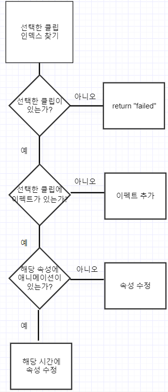
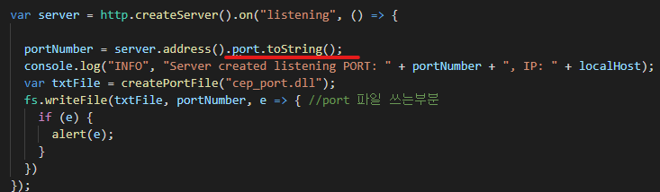
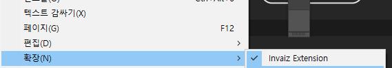
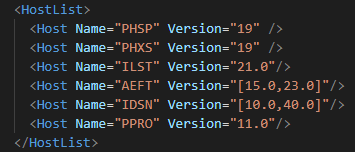
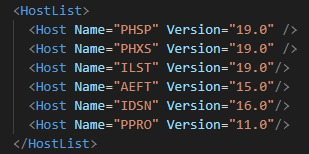

# 11월 3주차 주간회의록

## 주간 작업 목록

- [x] CEP 코드 리팩토링 70% 진행
- [ ] CEP 개별 코드사인 자동화 스크립트
- [x] 인디자인 17.0.1v 테스트
- [x] 인바이즈 스튜디오 v1.6.0 테스트 및 업데이트

## 1. CEP 코드 리팩토링

#### 1-1. 객체 및 함수 네이밍 재설정

기존 CEP 소스에 중복되는 소스코드가 많이 있었고 함수명 및 객체 네이밍이 통일화 되어있지 않아 나름의 규약을 만들었다.

```js
PR_Opacity = {
  modifyOpacity: function () {},
}; //기존 객체 네이밍 방식
PrOpacty = {
  modifyOpacity: function () {},
}; //개선된 네이밍 방식
```

기존 객체 네이밍 방식은 `파스칼 표기법` + `스네이크 표기법`으로 되어있었지만 지금은 `파스칼 표기법`으로 개선해서 코드의 가독성을 높였다.

이 작업을 모든 CEP 프로젝트에 진행하였고 완료하였다.

#### 1-2. 중복코드 수정(진행중)

프리미어프로에서 속성값을 변경하는 플로우 차트는 아래와 같다.



전체적인 플로우 차트는 위와 같지만 **중간 중간 서브 속성이 존재할 수있다**.
예를들어 `불투명도 조절`은 `0번(불투명도)` 속성만 조절하면 되지만 `위치 조정`은 `0번(위치)` 속성 안에서 `1번(X 포지션)` 속성을 조절해야만 x포지션이 수정된다.

따라서 속성값을 변경하는 전체적인 소스코드는 **모두 동일**하지만 중간 중간에 서브 속성이 존재하기 때문에 따로 소스를 분리 시켜놓았다. (불투명도 , 비율, 루메트리 각각 따로 분리 해놓았기 때문에 중복되는 소스코드가 존재)

이렇게 때문에 전체적인 소스코드를 하나의 **모듈로 통합**시킬 예정이다.
속성마다 서브 속성이 존재할 경우 `swich`문으로 분기를 시키거나 함수에서 파라미터를 받을 때 객체로 받아 서브속성의 존재유무를 체크한다.

## 2. CEP 개별 코드사인 자동화 스크립트.

CEP에도 코드사인을 해야한다. 코드사인이 정상적으로 되지 않으면 `확장이 제대로 서명되지 않았습니다` 라는 에러창이 뜬다.

통합 CEP 서명 스크립트는 아래와 같다

```
$ZXPSignCmd -selfSignedCert KR VA Invaiz Changjundev jun9121 InvaizCert.p12

$ZXPSignCmd -sign com.invaiz.extension com.invaiz.extension.zxp InvaizCert.p12 jun9121
```

이 부분을 프로그램 별로 코드사인 진행할 예정임

## 3. 인디자인 v17.0.1 테스트

인디자인 22년도 버전에서 CEP로드가 정상적으로 되지 않는 버그가 생김.
해당 문제의 원인은 포트번호를 생성하는 함수에서 textfile에 포트번호를 쓸때 타입이 number여서 발생하는 문제



따라서 해당 변수를 `toString()` 함수로 타입캐스팅 하였다.



## 4. 인바이즈 스튜디오 v1.6.0 테스트 및 업데이트

이번 업데이트는 `CEP 버전 통합` 및 `프리미어 프로 속성값 변경` 2가지 이슈가 있어서 진행했다.

#### 4.1 CEP 버전 통합

기존 `manifest.xml`파일의 `HostList`의 버전관리는 개판이였다.
이전 일러스트레이터 호환성 이슈가 생긴것도 버전 명시를 제대로 하지 않아 발생했었다.



버전 명시하는 규약을 찾아서 적용했다.  
버전 명시하는 방법은 2가지이다.

```
<Host Name="호스트명" Version ="최소버전"/>
<Host Name="호스트명" Version ="[최소버전,최대버전]"/>
```



**19년도 버전 ~ 22년도 버전**과 모든 호환성을 갖추었다.

#### 4.2 프리미어 프로 속성값 변경

프리미어프로 v22.0에서 **lumetri 속성값이 변경되는 사항**이 생겼다.  
디버깅 해본 결과 다행이도 index가 2씩 증가하였는데 프리미어 프로의 버전을 체킹하고 해당 버전이 22버전 이상이면 속성값을 2씩 증가시켰다.

```js
 //프리미어 프로 버전을 구하는 함수
  getVersion: function () {
    var str = app.version.split('.');
    return parseInt(str[0]);
  }
```

```js
lumetriMinMax: function (props, value, version) {
    var temp = version >= 22 ? 2 : 0;
    switch (props) {
      //hdr white
      case 7:
        return PrUtils.minMax(value, 100, 1000);
      //온도 , 색조
      case 10 + temp:
      case 11 + temp:
        return PrUtils.minMax(value, -300, 300);
      //노출
      case 14 + temp:
        return PrUtils.minMax(value, -7, 7);
      //대비 ,명도 , 어두운영역 ,흰색, 검정
      case 15 + temp:
      case 16 + temp:
      case 17 + temp:
      case 18 + temp:
      case 19 + temp:
        return PrUtils.minMax(value, -150, 150);
      ...
    }
}
```
