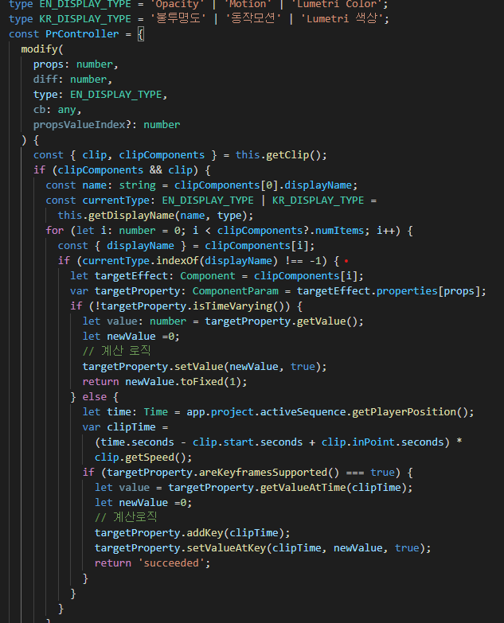
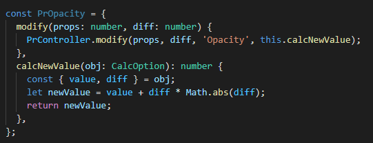

# 11월 4주차 주간회의록

## 주간 작업 목록

- [x] 프리미어프로 타입스크립트 개발환경 셋팅
- [x] 프리미어프로 코드 리팩토링
- [x] UXP 타입스크립트 셋팅
- [x] EV Global Codesign 진행

## 1. 프리미어프로 타입스크립트 개발환경 셋팅

기존 CEP는 자바스크립트 es3문법으로 개발된다. es3문법은 제한적인 문법이 너무 많아 개발하기 힘들뿐더러
CEP가 타입관리도 잘 되지 않기 때문에 추후 유지보수를 위해 타입스크립트 환경에서 프로젝트를 재개발 하기로 했다.

프리미어프로의 타입을 모아놓은 `index.d.ts` 파일을 찾고 필요한 타입들을 추가해서 기본적인 개발환경을 구성했다.

## 2. 프리미어프로 코드 리팩토링

기존 중복되는 소스코드 때문에 하나의 문제가 발견되면 4개의 소스를 고쳐야하고 소스자체도 지저분했는데
타입스크립트 개발환경에서 전부 리팩토링 진행했다.

전체적인 모듈을 `Controller`라는 객체를 만들어 분리했고 각각의 상황에 따른 알고리즘을 캡슐화하여 모드가 바뀔 때마다 상황에 맞는 알고리즘을 컨트롤러의 콜백함수로 넣어주는 `전략패턴`으로 설계했다.

## 3. UXP 타입스크립트 셋팅

마찬가지로 기존 자바스크립트로 구현했던 UXP소스를 타입스크립트로 변환하려고 개발환경 설정

1차배포는 기존 자바스크립트 코드로 인바이즈 스튜디오 2.0에 넣어서 배포예정.

추후 유지보수랑 업데이트시 타입스크립트 적용할 계획

## 4. EV Global Codesign 진행

코드사인 신청서류 작성완료했고 코드사인 SDK 환경셋팅 새로 진행.

이번주쯤 usb 인증토큰 새로 도착 예정
