# 11월 4주차 주간회의록

## 주간 작업 목록

- [x] 포토샵 UXP 배포준비
- [x] 프리미어프로 코드 리팩토링
- [x] EV Global Codesign 진행
- [x] 포토샵 카메라로우 자료 서치

## 1. 포토샵 UXP 배포준비

1차적으로 플러그인 테스트 배포를 위해 만들어놓은 프로젝트에 버전 업데이트 식으로 진행

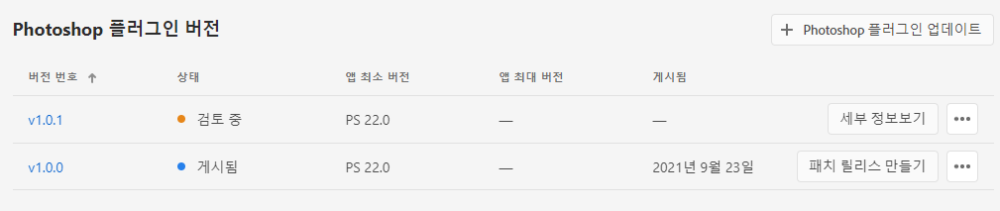

- CEP 기능 모두 구현 완료
- 텍스트 기능 추가 완료
- 레이어 직접 제어하는 기능 추가예정 (회전,크기제어 등)

## 2. 프리미어프로 코드 리팩토링

- ## 📁src/modules.ts

```ts
interface CalcOption {
  value: number;
  diff: number;
  props: number;
  propsValueIndex: number | undefined;
}
interface CalcMotion {
  value: any;
  diff: number;
  props: number;
  propsValueIndex: number | undefined;
}
const PrOpacity = {
  modify(props: number, diff: number) {
    PrController.modify(props, diff, 'Opacity', this.calcNewValue);
  },
  calcNewValue(obj: CalcOption): number {
    const { value, diff } = obj;
    let newValue = value + diff * Math.abs(diff);
    return newValue;
  },
};

const PrMotion = {
  modify(props: number, diff: number, propsValueIndex: number) {
    PrController.modify(
      props,
      diff,
      'Motion',
      this.calcNewValue,
      propsValueIndex
    );
  },
  calcNewValue(obj: CalcMotion) {
    const { value, diff, propsValueIndex } = obj;
    let newValue: number | number[];
    if (propsValueIndex) {
      newValue = this.calcPositionValue(value, diff, propsValueIndex);
    } else {
      newValue = value + diff * Math.abs(diff);
    }
    return newValue;
  },
  calcPositionValue(value: any, diff: number, props: number): number[] {
    var standard = props === 0 ? 640 : 320;
    var newValue = standard * value[props] + diff * (Math.abs(diff) * 1.7);
    value[props] = newValue / standard;
    return value;
  },
};

const PrLumetri = {
  modify(props: number, diff: number) {
    const version = PrController.getAppVersion();
    props += version >= 22 ? 2 : 0;
    PrController.modify(props, diff, 'Lumetri Color', this.calcLumetri);
  },
  calcLumetri(obj: CalcOption) {
    const { value, diff, props } = obj;
    const version: number = parseInt(app.version.split('.')[0]);
    let newValue = value + diff * Math.abs(diff);
    let temp: number = version >= 22 ? 2 : 0;
    switch (props) {
      case 10 + temp:
      case 11 + temp:
        return PrUtils.minMax(newValue, -300, 300);
      default:
        return 0;
    }
  },
};
```

- ## 📁src/controller.ts

```ts
const { clip, clipComponents } = this.getClip();
if (clipComponents && clip) {
  const name: string = clipComponents[0].displayName;
  const currentType: EN_DISPLAY_TYPE | KR_DISPLAY_TYPE = this.getDisplayName(
    name,
    type
  );
  for (let i: number = 0; i < clipComponents?.numItems; i++) {
    const { displayName } = clipComponents[i];
    if (currentType.indexOf(displayName) !== -1) {
      let targetEffect: Component = clipComponents[i];
      var targetProperty: ComponentParam = targetEffect.properties[props];
      if (!targetProperty.isTimeVarying()) {
        let value: number = targetProperty.getValue();

        // 객체별 계산 로직 콜백함수로 넘김
        let newValue = cb({
          value,
          diff,
          props,
          propsValueIndex,
        });
        targetProperty.setValue(newValue, true);
        return newValue.toFixed(1);
      } else {
        let time: Time = app.project.activeSequence.getPlayerPosition();
        var clipTime =
          (time.seconds - clip.start.seconds + clip.inPoint.seconds) *
          clip.getSpeed();
        if (targetProperty.areKeyframesSupported() === true) {
          let value = targetProperty.getValueAtTime(clipTime);
          // 객체별 계산 로직 콜백함수로 넘김

          let newValue = cb({
            value,
            diff,
            props,
            propsValueIndex,
          });
          targetProperty.addKey(clipTime);
          targetProperty.setValueAtKey(clipTime, newValue, true);
          return 'succeeded';
        }
      }
    }
  }
}
```

### 개선 완료된점

## 3. EV Global Codesign 진행

- ### SDK 셋팅 및 기업용 인증서 발급 완료

  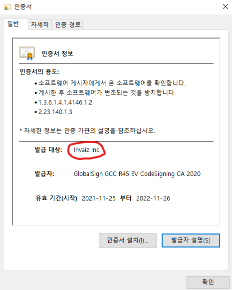

- ### 패키지 수정

  

- ### 코드사인 진행 및 완료
  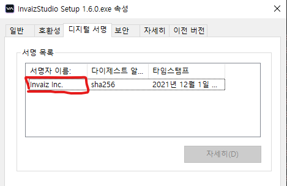

## 4. 카메라로우

라이트룸, 브릿지, 포토샵 등으로 편집이 끝나면  
결국 카메라로우에서 편집을 한번 더하고 포토샵으로 보정을 함

카메라 로우의 개발의 필요성을 느끼고 서치 시작

### - 서치 내용

루프덱을 테스트 해본결과

#### JSX로 제어하는것은 아닌것 같음

카메라 로우 자체가 포토샵 플러그인이기 때문에 JSX로 카메라로우 제어하는것은 불가능

#### Lua인가?

꼼꼼히 보니 라이트룸 클래식과 카메라로우의 UI가 굉장히 비슷했다.

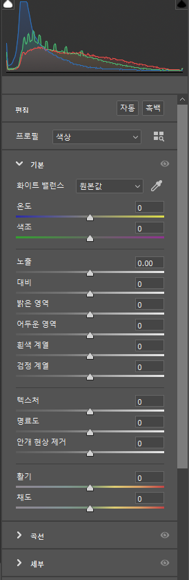
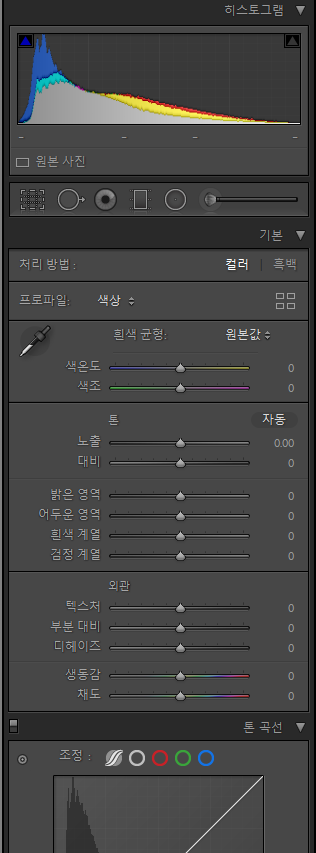

그래서 루아로 제어할 수 있는지 찾아본 결과 역시 루아로 제어하는것은 아니였다.

#### UXP로 가능할까?

루프덱 플러그인을 삭제하고 카메라로우를 제어해봤는데 잘 작동되었다.
**결론은 UXP도 아니였다**

### - 루프덱 리버싱 시작

다행히도 루프덱 3.0버전을 보관하고 있어서 리버싱을 할 수 있었음.

꼼꼼히 리버싱을 해본 결과 결국 `win32API`로 해야하는것을 발견

### - 개발

- 카메라로우 제어 플로우차트

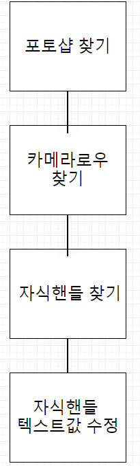

- WIN32API로 테스트 진행

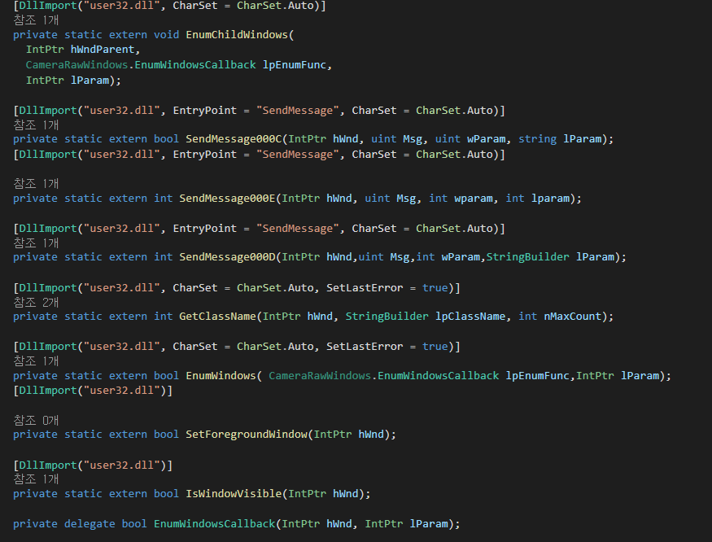

### - 결과

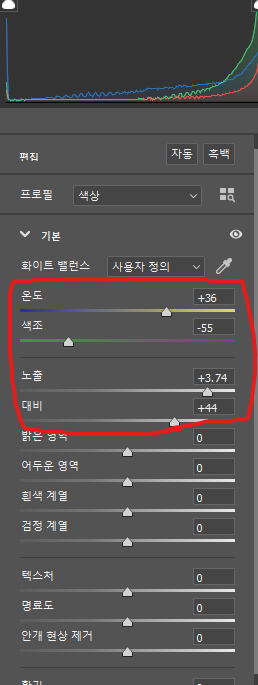
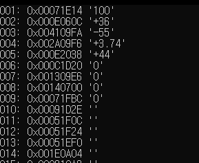

### - 문제점

자바스크립트로 변환해야함
자바스크립트는 `브라우저기반` 언어여서 운영체제가 제공해주는 API기능이 **한정적임**

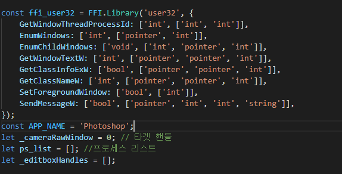

문제는 정확한 핸들값이 안나오는 문제

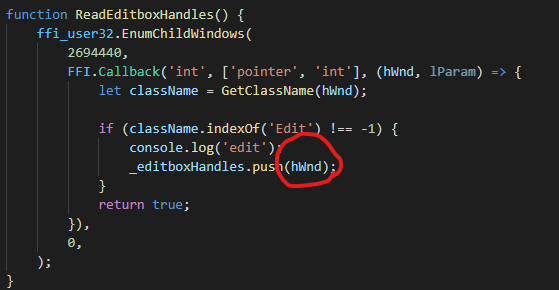

### - 해결방안

1. 다른 API를 찾아본다.
2. node-gyp 를 사용해본다.
3. c#으로 dll파일을 만들어 일렉트론이랑 연동한다.
