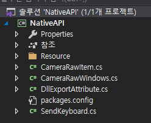
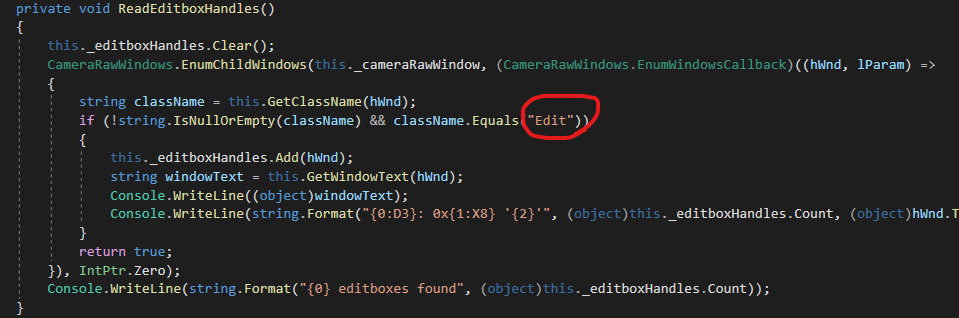
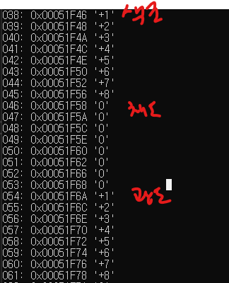
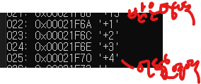
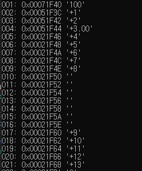
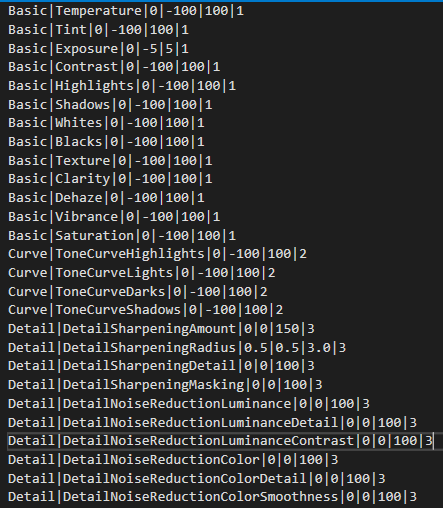
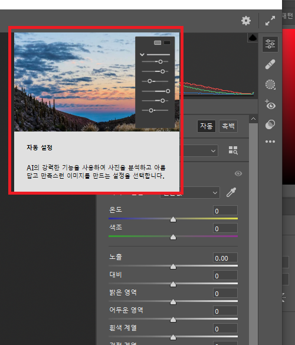
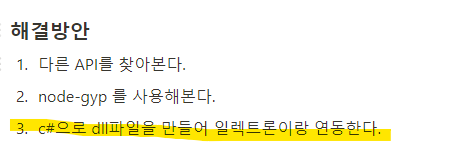

# 12월 2주차 주간회의록

## 주간 작업 목록

- [x] 카메라로우 NativeAPI 개발
- [x] 카메라로우 데이터셋 정리
- [x] 카메라로우 핸들값 버그 수정
- [x] electron C# Dll injection

## 카메라로우 NativeAPI 개발

카메라로우는 특별한 플러그인이나 스크립트를 제공하지 않음.  
따라서 `운영체제 핸들값`을 찾아 그 핸들의 값을 직접 제어 해야함.

윈도우 운영체제의 API (WIN32API)를 C, C++, C# 등으로 개발하여야 함  
`C#`언어를 선택하고 **인바이즈만의 카메라로우 플러그인**을 자체개발함



## 카메라로우 데이터셋 정리

아래 그림과 같이 포토샵 자식 핸들인 카메라로우 핸들에서 자식 핸들을 한번 더 뽑고 그 클래스 이름이 `Edit`이라는 핸들의 값을 추출하는 과정임.


아래는 추출 과정





하나하나 디버깅하고 테스트 완료해서 데이터 셋을 만듦  
데이터 셋은 아래와 같은 형태

```
패널이름|속성값|기본값|최소값|최대값|패널인덱스
```

결과  


이 인덱싱한 데이터 셋을 기반으로 프리셋 제작할 예정  
프리셋 `etype`은 `sendNativeAPI`로 우선 정해놓음

```
{
  "fname": "온도",
  "etype": "sendNativeAPI",
  "fcode": {
     "messageType": "adjustment",
     "actionType": "changeAdjustmentValue",
     "typeKey": "Temperature"
   }
}
```

## 카메라로우 핸들 값 버그 수정

핸들 텍스트를 추출하던 도중 자꾸 자식 핸들 값이 null로 나오게 되는 버그가 발생함.
원인을 분석해본 결과


위와 같이 특정 기능에 `hover`를 하면 툴팁(?) 같은게 나오는데 그 창이 카메라로우 창과 동일한 값을 가지고 있어서 다른 핸들을 잡았던 버그를 발견함. 따라서 현재 창 이름 까지 중복으로 확인하여 `Camera Raw`인 창만 잡게끔 수정완료

## electron C# DLL injection

지난주 `Native API`는 자바스크립트로는 제한적이라는 결과가 나오고 그 해결 방안으로 아래 3가지를 제시했으며 3번방법을 선택함



dll injection을 하기 위한 모듈을 여러개 찾아 시도해봤지만 결론적으로  
`electron-edge-js`를 사용하기로 했음

```js
const edge = require('electron-edge-js');
const cameraRaw = edge.func({
  assemblyFile: 'DLL 파일 경로',
  typeName: '네임스페이스.클래스이름',
  methodName: '실행할 함수',
});
```

위와 같은 형태로 dll을 호출하고 그 내부에 있는 함수에 접근할 수 있음.

# 결론은 호환 성공했음. 프리셋 만들어서 통신해본 결과 아주 잘됨

## 고려사항

- 아직 RAW파일은 테스트 안해봄 (온도 값 범위)
- 포토샵 버전별로 카메라로우 기능이 다른지 체크해봐야함
- 빌드 시 dll이 제대로 패키징 되는지 테스트 해봐야함
- 맥은 따로 개발해야함..
