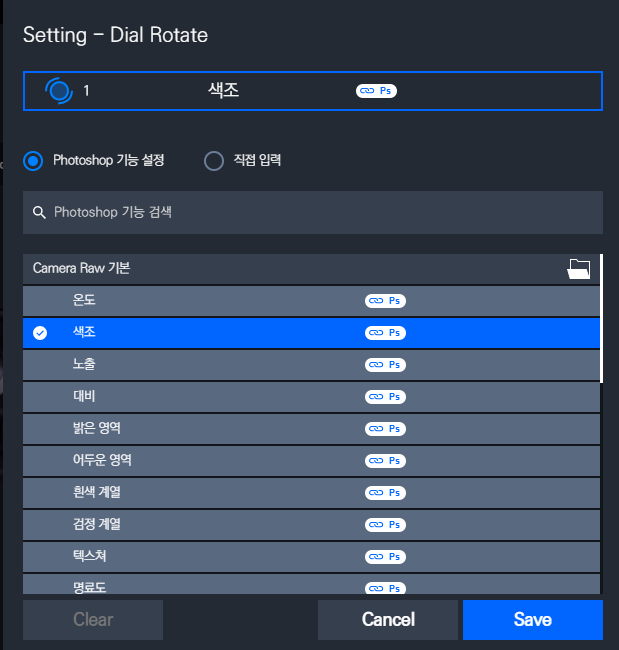

# 12월 3주차 주간회의록

## 주간 작업 목록

- [x] 카메라로우 Raw파일 환경 개발
- [x] 카메라로우 UX개선
- [x] 카메라로우 단축키 정리
- [x] 인바이즈 스튜디오에 데이터 추가 작업후 1.7.0 테스트빌드
- [ ] 카메라로우 추천프리셋 만들기

## 카메라로우 Raw파일 환경 개발

카메라로우에서 보통 Raw파일을 주로 편집하는 경우가 많은데 이전은 일반 사진 기준(JPG,PNG 등)의 파일로 작업을 했다.

Raw파일을 처리하기 위해 두가지 방법을 사용하였다.

### 1. 카메라로우 클래스 이름으로 구별하기

카메라로우는 두가지 클래스 네이밍을 가진다. 첫 번째는 `PSFilter_WindowClass`인데 이 클래스 네이밍은 카메라로우로 일반파일을 편집할 때 생성되는 클래스 네임이다.  
두 번째는 `CameraRaw_WindowClass`로 Raw파일을 편집할 때 생성되는 클래스 네임이다.
이 것을 기점으로 첫번째 로우파일 필터링을 하였다.

### 2. 로딩시 'Temperature'값 가져오기.

로딩시 `GetValue` 함수를 만들어 처음 들고오는 값이 `101.0f` 이상이면 로우파일로 판단하였다. Raw파일의 `Temperature` 값의 범위는 `2000`~ `50000`까지기 때문이다.

해당 로우파일을 다 판단하고 나면 기존의 카메라로우 인덱싱한 데이터 값이 달라진다.  
해당 인덱싱은 기본파일 기준으로 하였기 때문이다.  


위 그림과 같이 같은 광학 패널인데 `프로필` 이라는 탭이 생겼다. 디버깅 해본결과 인덱싱이 `광학패널`기준으로 2칸씩 밀려있었다.  
따라서 카메라로우 타입체크하는 변수를 만들고 해당 리소스파일을 읽어오게 구현했다.

```c#
        public bool IsOpen()
        {
            this._cameraRawWindow = IntPtr.Zero;
            CameraRawWindows.EnumWindows((CameraRawWindows.EnumWindowsCallback)((hWnd, lParam) =>
            {
                string className = this.GetClassName(hWnd);
                if (!string.IsNullOrEmpty(className) && className == "PSFilter_WindowClass")
                {
                    string windowText = this.GetWindowText(hWnd);
                    if (windowText.Contains("Camera"))
                    {
                        this._cameraRawType = 1;
                        this._cameraRawWindow = hWnd;
                        _isOpen = true;
                        return false;
                    }
                }
                else if (!string.IsNullOrEmpty(className) && className == "CameraRaw_WindowClass")
                {
                    string windowText = this.GetWindowText(hWnd);
                    if (windowText.Contains("Camera"))
                    {
                        this._cameraRawType = 2;
                        this._cameraRawWindow = hWnd;
                        _isOpen = true;
                        return false;
                    }
                }
                return true;
            }), IntPtr.Zero);

            return false;
        }
```

```c#
   public void Init()
    {
            IsOpen();
            GetEmbeddedResourceMatchIndex("NativeAPI", "Resource.CameraRawIndex" + _cameraRawType + ".txt");
            GetEmbeddedResourceItem("NativeAPI", "Resource.CameraRawItem.txt");
            isRawFile();
    }
```

## 2. 카메라로우 UX개선

속성값 을 조절할 때 라이트룸 처럼 해당 속성에 포커싱(패널 오픈)이 되지 않는다. 라이트룸과 같은 사용성을 만들기 위해 카메라로우에서 해당속성을 조절할 때 해당 인덱스 번호를 저장해놓고 강제입력으로 구현하려했다.

```
Basic|Temperature|0|-100|100|1|1
분류|파라미터명|기본값|최소값|최대값|가중치|패널인덱스
```

각각의 속성들의 패널 인덱스를 저장해놓고 요청이 끝나면 강제입력을 하도록 구현했다.

기존에 사용하던 `sendInput` api를 사용하려했지만 dll파일에서 동작이 되지 않아 `keyboard_event` 함수로 대체하여 해본결과 라이트룸과 같은 UX에 구현 성공하였다.

## 3. 카메라로우 단축키 정리

버튼키역시 단축키로 정리하여 공식문서를 확인하고 정리하였다.
아직 카메라 로우에 익숙하지 않아서 몇몇 안되는 기능이 있는데 바뀐건지 못쓰는건지 모르겠다. 계속 공부하면서 테스트하고 정리할 예정.

## 4. 인바이즈 스튜디오에 데이터 추가작업




작업이 끝나고 배포를 해본결과 NativeAPI.dll파일을 로드할 수 없다는 버그가 발생했다.

빌드될 때 패키지내에 포함되어서 나올줄 알았는데 그게아니였던것 같아서 찾아본 결과
패키징시 외부파일을 따로 종속시켜 설치해야한다고 한다. 그래서 `package.json`파일을 아래와 같이 수정하였다.

```json
  "build": {
      //...
        "win": {
            "extraFiles": [
                {
                    "from": "./lib/NativeAPI.dll", //패키징시 포함시킬 파일
                    "to": "." // 설치경로 (루트로 설정)
                }
            ]
        },
    },
```

## 5. 카메라로우 추천프리셋 만들기

아직 카메라로우를 정확히 공부하지 못해서 프리셋을 만드는게 어렵다고 판단  
테스트용으로 대충 매핑한 프리셋은 의미가 없기 때문에 최대한 라이트룸 프리셋과 비슷하게 만드려고하는데 버튼기능이 아직 뭔지 이해가 안감
