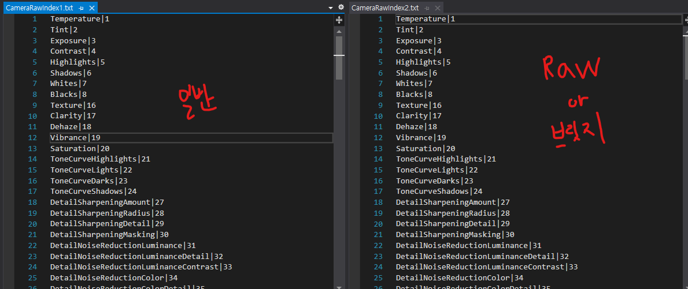
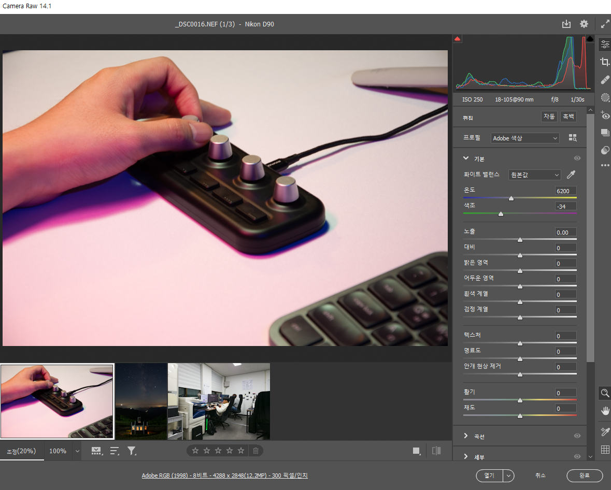
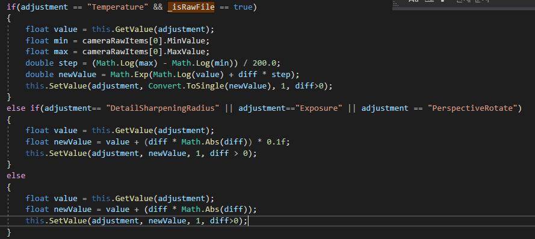
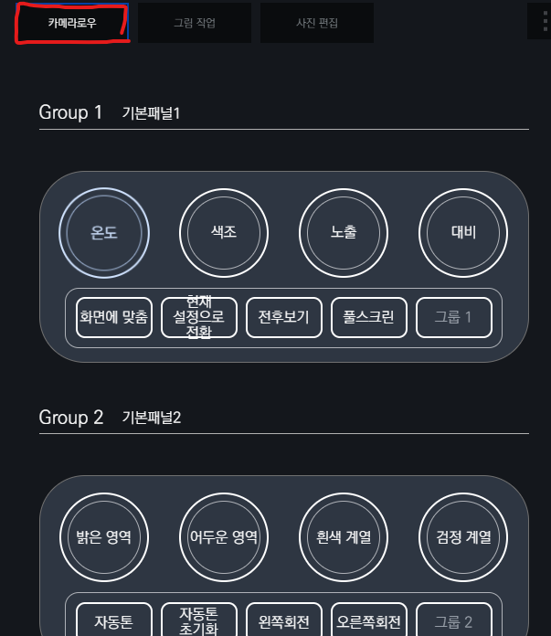
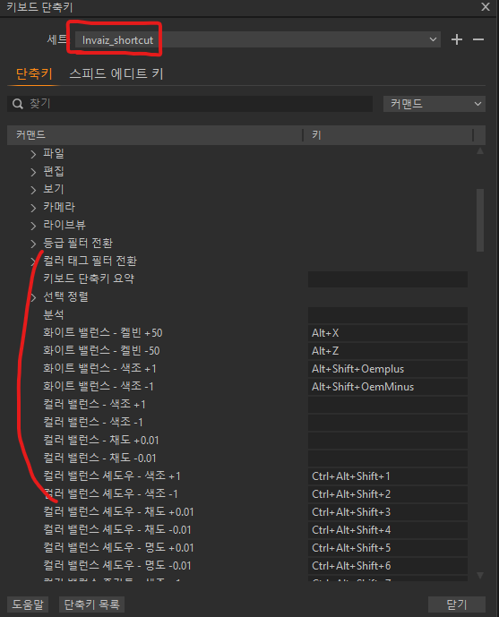
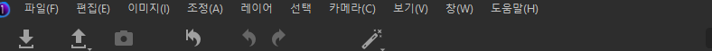
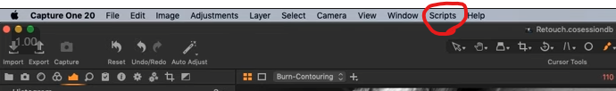

# 12월 4주차 주간회의록

## 주간 작업 목록

- [x] 카메라로우 x 브릿지 사용성 테스트(실제 편집 환경)
- [x] 파라미터값 소수점 계산
- [x] 카메라로우 단축키 정리
- [x] 추천 프리셋 만들기
- [x] 1.7.0 테스트 버전 배포
- [x] 캡쳐원 방식 서치

## 카메라로우 x 브릿지 사용성 테스트(실제 편집 환경)

카메라로우를 작업할 때 어도비 브릿지를 사용해서 편집을 한다.  
어도비 브릿지 기준으로 실제 편집을 해보면서 단축키를 익힘

우선 어도비 브릿지를 사용하면 카메라로우에서 사진 여러장 편집 가능  
또한 Raw파일에만 존재하는 기능(프로필 편집)이라고 생각했지만 브릿지에서 JPG파일을 열었을 때  
Raw파일을 제외한 다른 파일에도 사용할 수 있어서 두가지의 분류를 진행함.
해당 분류를 `_cameraRawType`이라는 변수로 체크하고 Raw파일 or 브릿지에서 작업이면 `2`  
포토샵 필터를 사용해서 작업하면 `1`로 간주하고 리소스파일을 가져올 때  
`"CameraRawIndex + _cameraRawType + .txt"` 형태로 가져옴

아래는 분류하는 알고리즘을 요약한 글.

### 1. Raw파일인가?

Raw파일인지 체킹하는 방법은 `온도`값을 가져와 그 값이 `101`이상이면 Raw파일로 판단.  
이때는 `_cameraRawType=2`

### 2. 브릿지에서 카메라로우를 켰는가?

브릿지에서 카메라로우를 그 파일이 JPG이던 RAW파일이던 상관없이 클래스이름이 `CameraRaw_WindowClass`로 되었음.  
(`CameraRaw_WindowClass`에서는 어떤 사진인지 상관없이 프로필 편집 기능을 사용할 수 있음)
브릿지에서 카메라로우를 켰으면 `_cameraRawType = 2`

### 3. 이외

그 이외는 포토샵 필터로 JPG,PNG등의 파일을 작업하는 것으로 판단하고 `_cameraRawType=1`

## 2. 파라미터값 소수점 계산

소수점 값을 가진 파라미터 `노출`, `반경` `회전` 값 3가지이다.  
기존에는 해당 값을의 가중치를 저장해놓고 계산이 끝나고 곱하려고 했지만 연산의 우선순위 때문에 값이 이상하게 나왔음.

그래서 `if`문으로 분기를 시켜 해당 값들만 따로 알고리즘을 구현함

## 3. 카메라로우 단축키 정리

브릿지와 함께 사용하면서 카메라로우 단축키를 익히고 그 단축키들을 정리해놓았음.

## 4. 추천 프리셋 만들기

브릿지와 연동하면서 단축키를 공부한 뒤 최대한 라이트룸 클래식 추천프리셋과 동일한 형태로 제공한 프리셋을 만듦

## 5. 1.7.0 테스트 버전 배포

추천 프리셋을 넣고 테스트 버전 배포에 완료함  
테스트 버전 배포시 시작프로그램으로 실행될 경우 인바이즈 스튜디오가 터지는 버그가 발생했는데 로그파일을 확인해본 결과 시작프로그램으로 실행 시 루트경로가 system32폴더로 잡히기 때문에 dll load가 안되었음. 따라서 프로그램 절대경로를 가지고 오는 함수를 통해 dll로드를 진행해서 해결함

## 6. 캡쳐원 방식 서치

캡쳐원에 대한 니즈도 있어서 프로그램 개발전 필요한 환경을 서치함  
우선 무료버전을 다운받았으며 커스텀 단축키가 있다는 정보를 찾음

### 1. 커스텀 단축키 만들기

커스텀 단축키 파일은 `C:\Users\{user}\AppData\Local\CaptureOne\CustomCommands`에 있으며 파일 형식은 `xml`이였음  
따라서 캡쳐원 커스텀 단축키를 만드는 중에 있으며 테스트 해본결과 잘됨

### 2. AppleScript

스크립트는 `AppleScript`라는 언어로 개발하는데 무료버전이라 그런지 아니면 윈도우라 그런지 `스크립트`창이 안보임.. (mac만 스크립트 지원하는건가?)  

윈도우

맥
