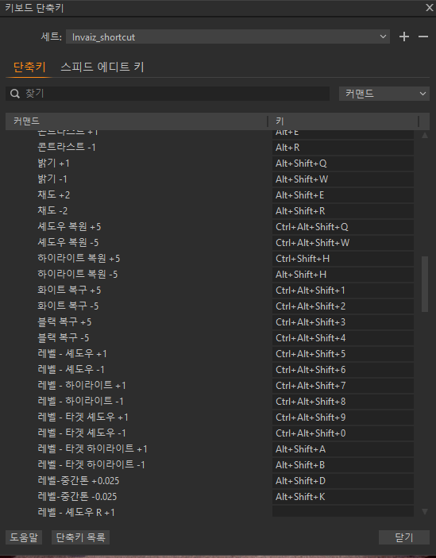
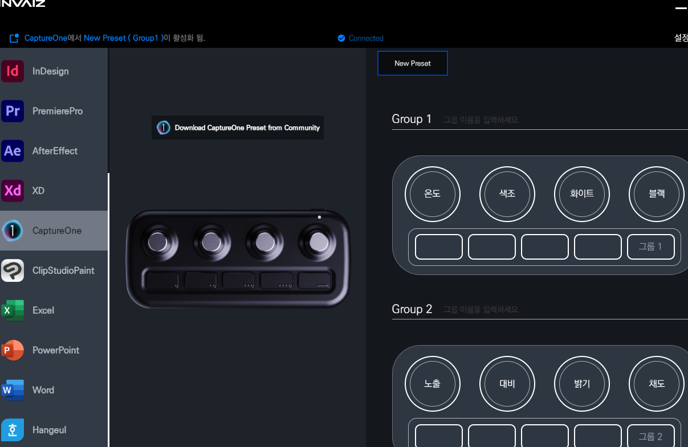
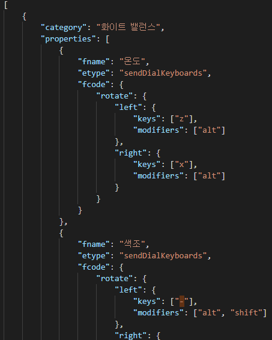
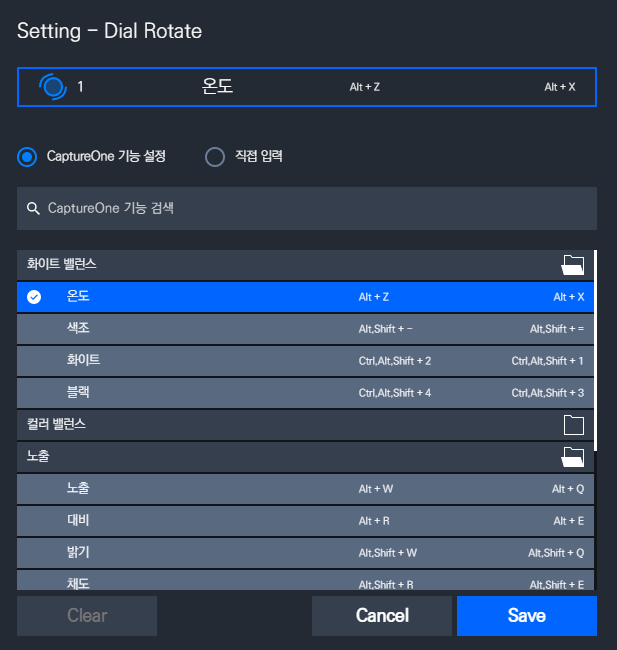

# 12월 5주차 주간보고서

- [x] 캡쳐원 단축키 리스트 만들기
- [x] 캡쳐원 개발 및 테스트

## 캡쳐원 단축키 리스트 만들기

캡쳐원 단축키 리스트를 만들었음.  
사용자들이 자주 쓰는 단축키(Ctrl + Z , Ctrl + A)는 최대한 피하면서 커스텀 키를 제작

아직 버튼기능은 익숙하지 않아서 다이얼만 최대한 정리 완료

## 캡쳐원 개발 및 테스트

캡쳐원을 공식 프로그램으로 추가하고 포커싱 테스트를 진행함.  
여기서 문제가 포커싱은 되는데 패널(파라미터가 있는 창)을 클릭을 해야 제대로 작동이 되는것 같음 (일단 기능부터 만들고 해결방안 탐색할 예정)

커스텀 단축키파일을 기준으로 데이터 작업을 완료하고 기능을 추가했음.

