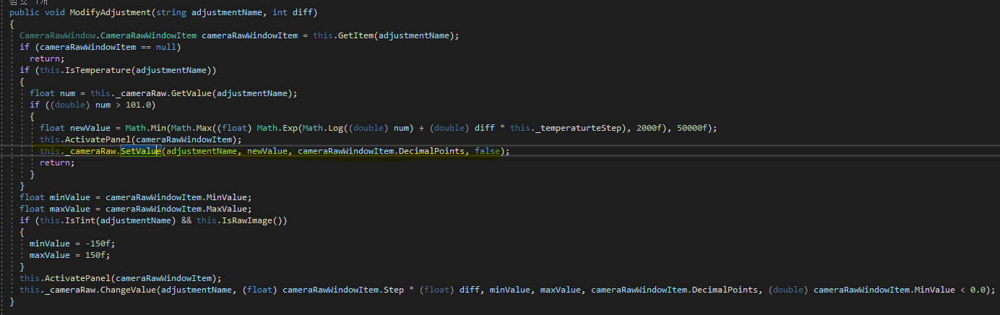

# 카메라 로우

## 1. JSX로 하는것은 아닌것 같음

## 2. Lua스크립트도 아닌것 같음

## 3. 연구내용

- 1. 함수명 가지고오기  
     루프덱 참조파일 폴더에 정리된 함수명 가지고 오는 소스
     

- 2. 파라미터 조절 함수
     루프덱 파라미터 조절 함수
     

- 3. 리플렉션 클래스  
     리플렉션은 어셈블리, 모듈 및 형식을 설명하는 개체를 제공한다. 리플렉션으 사용하면 **동적으로 형식 인스턴스를 만들거나, 형식을 기존 개체에 바인딩 하거나, 기존 개체에서 형식을 가져와 해당 메서드를 호출하거나, 필드 및 속성에 엑세스 할 수 있다.**
- 4. 윈도우 API 사용
     CameraRaw_WindowClass || PSFilter_WindowClass
