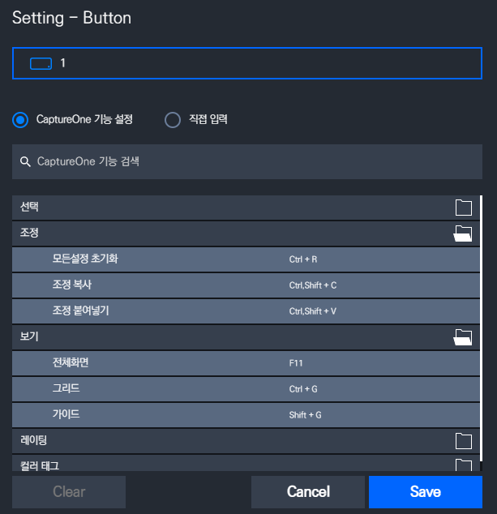
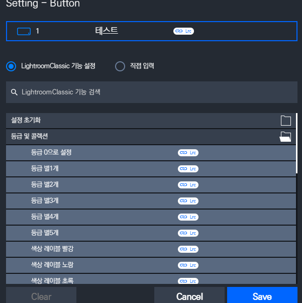
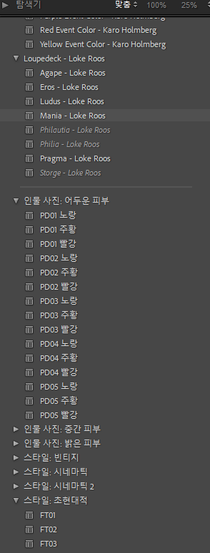
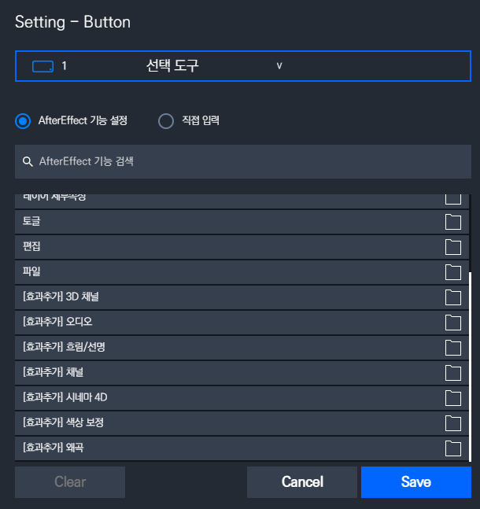

# 1월 1주차 주간 보고서

- [x] 캡처원 커스텀 단축키 리스트 생성
- [x] 라이트룸 등급 및 레이블 기능 추가
- [x] 라이트룸 보정 프리셋 만들기
- [x] 애프터 이펙트 효과 추가

## 캡처원 커스텀 단축키 리스트 생성

캡처원 커스텀 단축키 리스트 생성 완료하였고 버튼 키는 기능 만들면서 계속 추가 예정



## 라이트룸 등급 및 레이블 기능 추가

사진 편집 영상을 여러개 보면서 생각보다 등급 및 레이블 기능들을 많이 쓴다는것을 찾음

```lua
function setRating(newRating)
    local LrSelection = import 'LrSelection'
    if newRating == LrSelection.getRating() then
        newRating = 0
    end
    LrSelection.setRating(newRating)
end

function setColorLabel(newColorLabel)
    local LrSelection = import 'LrSelection'
    LrSelection.setColorLabel(newColorLabel)
	showBezel('Set color label to ' .. newColorLabel)
end
```

스크립트를 작성하고 테스트 해본 결과 잘 되는것을 확인함

따라서 기능을 추가하고 업데이트 예정


## 라이트룸 보정 프리셋 만들기

라이트룸 보정 프리셋 만드는 중인데 이 프리셋들이 각각 UUID가 존재함 이 것을 다 찾아 내는것은 상당한 노가다로 판단되어 라이트룸 자체에서 사전설정을 불러올 수 있는 스크립트를 찾는 중임



우선 인물사진 `PL02` 사전 설정의 UUID를 찾은 뒤 적용해본 결과 잘되었음.

```lua
function applyDevelopPreset(presetUuid)

	local LrApplication = import 'LrApplication'
	local preset = LrApplication.developPresetByUuid(presetUuid)
	local presetName = preset:getName() .. ' preset'

	local LrTasks = import 'LrTasks'
	LrTasks.startAsyncTask(function()
		local catalog = LrApplication.activeCatalog()
		catalog:withWriteAccessDo(presetName, function (context)
            local photos = catalog:getTargetPhotos()
            for _, photo in ipairs(photos) do
    			if photo ~= nil then photo:applyDevelopPreset(preset) end
            end

			showBezel(presetName .. ' applied')
		end)
	end)
end
```

## 애프터 이팩트 효과 추가


