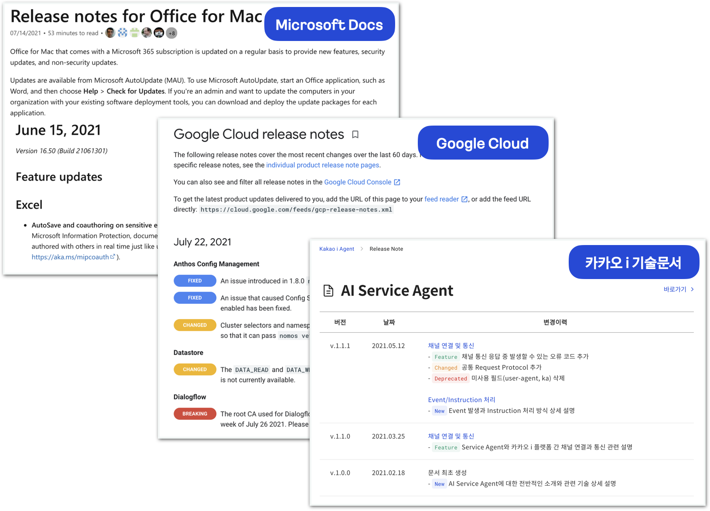
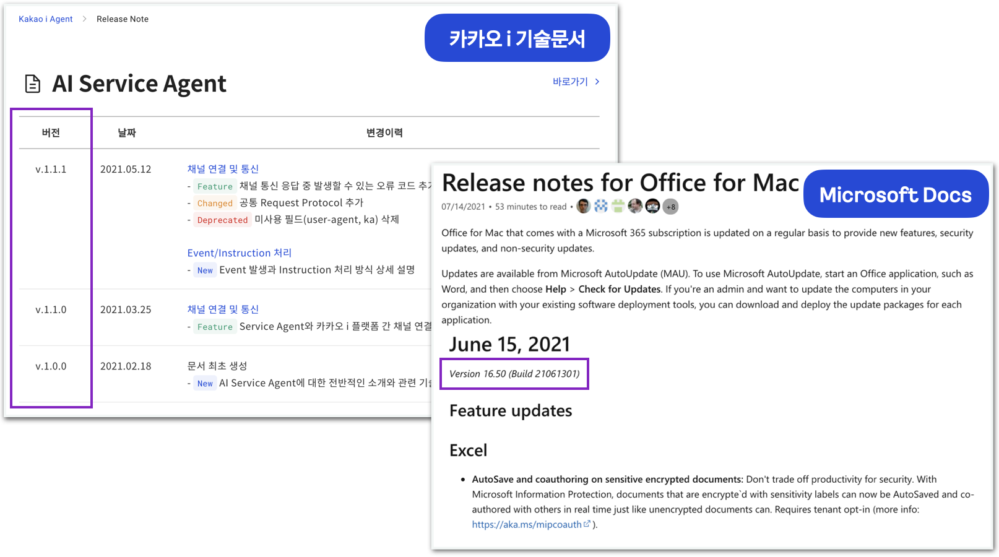
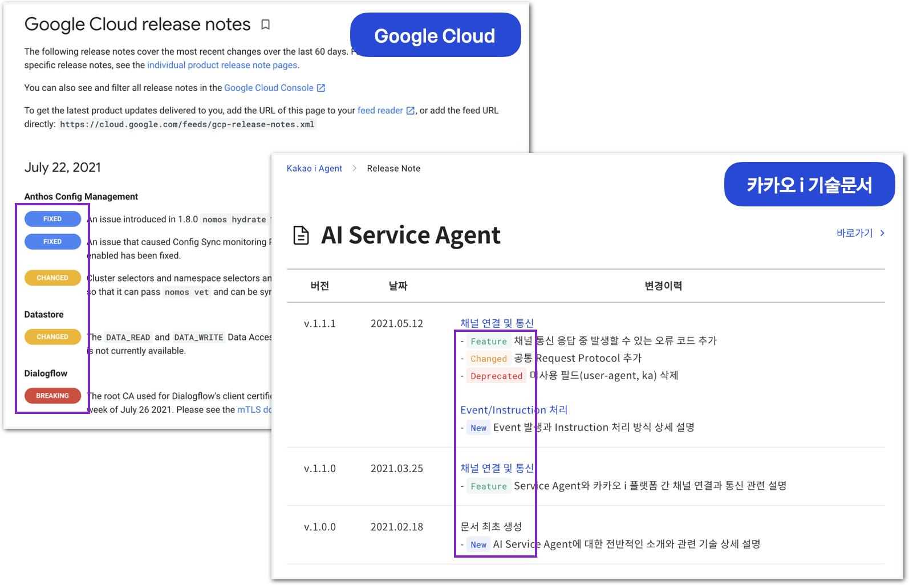

# 릴리즈 노트

## 릴리즈 노트란?

릴리즈 노트란 소프트웨어 또는 서비스가 출시 또는 업데이트 될 때마다 해당 상품의 배포와 함께 변경 사항, 기능 추가, 삭제, 버그 개선 등의 변경 사항을 체계적으로 정리하여 정보를 제공하는 문서이다.   
릴리즈 노트는 종이 매뉴얼, 모바일/웹 애플리케이션, 개발자 사이트 등 다양한 소스에 게시될 수 있다.

릴리즈 노트는 정보 공유 뿐만 아니라 우리 회사에 대한 `긍정적인 인상`을 심어주는 중요한 역할을 하는데 릴리즈 노트가 꼭 작성되고 공유되어야 하는 이유는 다음과 같다.

- 업데이트 정보를 한데 모아 기록함으로써, 내가 작업하지 않은 업데이트 사항도 빠르게 파악 가능.   
- 릴리즈 노트를 보면 누구나 제품의 발자취를 한눈에 파악 가능
- 우리 회사의 제품 혹은 서비스가 지속적으로 개선되고 최신의 상태를 유지하고 있음을 안내
- 사용자의 신고와 의견을 반양하고 있다는 인상을 주어 사용자의 적극적인 피드백을 유도

릴리자 노트가 중요한 이유는 다양하지만, 이러한 릴리즈 노트를 작성하려면 나름의 형식과 규약을 지켜야한다. 이러한 릴리즈 노트의 형식과 규약을 알아보자.

## 릴리즈 노트의 구성 요소

릴리즈 노트의 구성 요소는 사실 회사나 조직마다 준수해야 하는 표준이 있지만, 일반적으로 릴리즈 노트는 `버전`, `날짜`, `구분`, `설명`으로 구성된다. 그럼 각 항목을 자세히 살펴보자.

## 1. 버전

보통 **알파, 베타, 출시 후보, 출시**로 구성된 소프트웨어 배포 생명주기를 거치게된다. 내부 개발 단계에서는 다양한 소프트웨어 버전이 존재할 수 있지만 릴리즈 노트는 제품 출시 시점에 맞춰 `V.1.0.0` 부터 시작하며, 이후 발생하는 변경 사항은 마이너 버전 업데이트(소수점 둘째 자리), 패치 업데이트(소수점 셋째 자리)로 구분하여 버전을 업데이트 한다.

|버전|구분|설명|
|------|---|---|
|**VX.0.0**|메이저 버전|상품 또는 서비스 버전으로, 신규버전 또는 이전 버전과 호환되지 않은 대규모 업데이트가 발생한 경우|
|**V1.X.0**|마이너 버전|이전 버전과 호환 가능한 상태에서 신규 기능의 추가 혹은 삭제가 일어난 경우|
|**V1.0.X**|패치 버전|소프트웨어 API를 변경하지 않은 사소한 버그나 수정|

위의 표준과 같이 소프트웨어의 버전 구분은 버전관리에서 널리 통용되는 규칙으로서 고객들은 릴리즈 노트의 버전 정보를 보고 `이번에는 이러이러한 변화가 있었구나`, `이번 버전에는 이 기능이 추가되었네` ,`저번에 문의한 버그가 수정되었군` 등과 같은 변경 범위를 대략적으로 유추할 수 있게된다.

## 날짜

릴리즈 노트에는 버전 출시나 문서 업데이트에 따른 날짜 정보가 포함되며, 날짜는 해당 문서가 얼마나 최신인지를 보여준다.   
날짜를 표기할 때는 `영어식 표기`또는 `국어식 표기`중 하나의 스타일을 정하고 전체 문서에 일관된 스타일을 유지하는 것이 중요하다.   
구글의 스타일 가이드를 보면 가능하면 월을 알파벳으로 풀어쓰고, 숫자로만 날짜를 표기해야할 경우 하이픈(-)을 사용하고 슬래시(/)는 사용하지 말 것 등의 구체적인 사례를 제시하고 있다.

## 구분

구분은 사용자들에게 해당 기능이 신규 기능인지 수정 사항인지 변경사항을 빠르게 알 수 있는 태그 역할을 한다. 구분이 없다면 사용자는 자신이 찾기 위한 변경점을 하나하나 다 찾아야 하기 때문에 번거롭다.

|구분(tag)|설명|
|------|---|
|New(최초)|새로운 서비스(문서)가 출시된 경우|
|Feature(기능)|새로운 기능이 추가된 경우|
|Changed(변경)|기존 기능이 수정된 경우|
|Fixed(수정)|기존의 오류및 버그가 수정된 경우|
|Deprecated(중단)|제공하고 있던 기능이 중단된 경우

## 릴리즈 노트 작성 Tip

## 1. 버그 수정 및 성능 개선은 그만

많은 개발자들이 "버그 수정 및 성능 개선" 이라는 문구만 반복적으로 사용하고 있다. 이런 릴리즈 노트 작성 방식을 지양해야 한다.

릴리즈 노트를 아주 길게 적을 필요는 없지만, 적어도 어떤 버그가 개선되었는지, 어떤 기능이 어떻게 추가되었는지 사용자가 파악할 수 있도록 작성하자.

## 2. 짧게 작성하고 링크를 활용

최대한 간결하게 작성하는것이 좋다. 릴리즈 노트의 항목들이 두 줄을 넘기게 되면, 고객들은 릴리즈 노트가 아닌 매뉴얼을 보고 있다고 생각할 수 있다. 릴리즈 노트의 목적은 간결하고 빠르게 변경사항을 보여주기 위함이기 때문에 문장 길이가 길어지면 가독성이 저하될 수 있다. 자세한 내용을 보여주고 싶다면 관련 문서를 페이지를 만들어 링크를 안내하는 것이 좋다.

## 3. 일관된 용어를 사용하기

작업자마다 사용하는 용어가 다른 경우가 존재한다. 예를 들어 `CEP 기능추가` , `플러그인 기능추가` , `버그 수정`, `버그 픽스` 등 각기 표현 방식이 다른데 내부 작업자들의 소통으로 용어를 통일화 하자

## 4. 사용자 관점에서 쉽게 작성하기

릴리즈 노트는 **독자를 위한 문서이다.** 사용자의 관점에서 쉽게 작성해야하며, 사용자가 어떤부분이 추가, 수정, 삭제 되었는지 쉽게 파악할 수 있도록 해야한다.   
예를 들어 `포토샵 기능 추가` 라고 적는것 보다 `포토샵 브러쉬 기능 추가` 라고 적는것이 더 가독성이 높다. 
