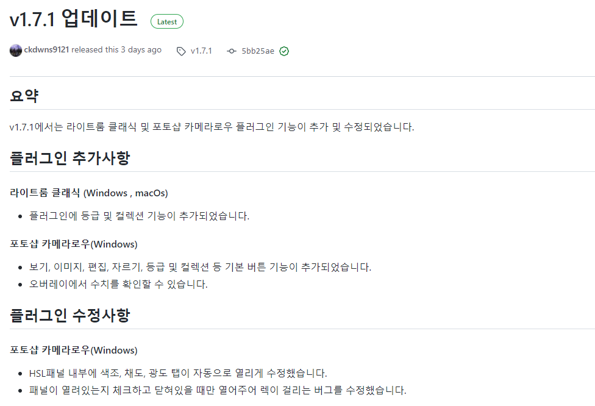

# 1월 3주차 주간보고서

- [x] 포토샵 픽셀유동화 NativeAPI 개발

## 포토샵 픽셀유동화 NativeAPI 개발

### 1. 개발 전 리서치

픽셀유동화에 대한 요청사항이 많아 개발을 진행하기로 했습니다.  
픽셀유동화가 개발되면 사진관 등 인물 사진 보정을 위주로하는 스튜디오에 큰 강점이 생길것으로 보입니다.

편집가능한 사진은 가족사진, 스냅사진, 증명사진, 단체사진 등 인물 위주의 사진은 모두 편집 가능합니다.

인물 보정하는 영상을 몇가지 찾아서 공부를 해본결과

**인물 보정 작업**은 `픽셀유동화` 필터로 얼굴 편집을 한뒤 포토샵으로 피부 톤보정, 잡티제거 등을 진행합니다.

**스냅사진** 같은경우는 픽셀유동화 필터로 간단하게 얼굴 편집을하고 조정레이어로 색감을 확인한 뒤 `카메라로우` 필터로 전체적인 색감 보정작업을 진행합니다.

결론은 **픽셀유동화** + **카메라로우** + **포토샵** 3가지를 지원하기 때문에 사진보정은 더욱 강력해지고 이후 사진 편집 프로그램을 확장해 나가는 전략을 구축해도 좋을듯 합니다.

### 2. 데이터 생성

카메라로우와 마찬가지로 특별한 **플러그인이나 API를 제공하지 않기** 때문에 직접 데이터를 생성하는 작업을 진행했습니다.

개발하면서 카메라로우보다는 훨씬 인덱스가 적고 Raw 파일에 대한 처리를 할 필요가 없어서 큰 예외사항이 존재하지 않았습니다.

;

카메라로우와 동일한 구조로 `Item File`에는 `카테고리|기능|기본값|최소값|최대값|패널인덱스` 형태로 저장하였고 `Index File`에는 `기능|인덱스` 순으로 저장했습니다.

> InvaizStudio에서 워크셋 데이터도 수정했습니다.

```json
        // 카메라로우
        {
                "fname": "온도",
                "etype": "sendNativeAPI",
                "fcode": {
                    "messageType": "cameraRaw",  ✅
                    "actionType": "changeAdjustmentValue",
                    "typeKey": "Temperature"
                }
        },
        // 픽셀유동화
        {
                "fname": "왼쪽 눈 크기",
                "etype": "sendNativeAPI",
                "fcode": {
                    "messageType": "liquify", ✅
                    "actionType": "changeAdjustmentValue",
                    "typeKey": "EyeSizeLeft"
                }
        },
```

### 3. 테스트 소스

우선 카메라로우 라이브러리와 픽셀유동화 라이브러리를 따로 개발할까 하다가 같은 라이브러리안에 통합시키기로 결정하고 기본적인 구조를 바꿨습니다.


`PhotoshopCotoller`라는 클래스에서 해당 요청이 카메라로우에 대한 요청인지 픽셀유동화에 대한 요청인지 처리하고 사용자의 요청에 따라 각 클래스의 함수를 호출하도록 변경했습니다.

이하 테스트 코드는 카메라로우의 플로우차트와 거의 동일하기 때문에 생략했습니다.

예외 사항이라면 픽셀유동화는 해당 탭을 열 수 있는 단축키가 존재하지 않기 때문에 `ActivePanel`함수는 삭제했습니다.(혹시 item file 구조에는 남겨놨음)

### 4. 버그 및 수정사항 검토

우선 카메라로우와는 달리 픽셀유동하는 모든 값이 `정수형`값이여서 실수형 처리가 되어있는 기존 코드를 정수형으로 바꿨습니다.

> 만약 왼쪽 눈을 조정하고 오른쪽 눈을 조정하고 따로따로 조정해야하는가?


다행이도 `link` 기능이 존재해서 해당 사항은 예외가 없습니다. 다만 `왼쪽 눈 조정`, `오른쪽 눈 조정`등 링크가 있는 기능들은 두개의 기능을 따로 제공할 지 통합해서 제공할 지 고민

### 5. 추천 프리셋 작업

배포 전 추천 프리셋 작업을 진행했습니다.
써보시고 변경사항이 필요하거나 추가했으면 좋을 기능들 말씀해주십쇼


### 6. 배포 테스트

**새로운 기능**이 추가되어 마이너 버전 업데이트인 소수점 둘째자리를 업데이트해 **1.8.0** 버전으로 테스트 배포 해볼까 합니다.

## 전달사항

1. 릴리즈 노트 구조를 바꿨습니다.

## 요약

v0.0.0은 ~~가 추가 수정 삭제 되었습니다.

## 플러그인 새로운 기능

### 프로그램 이름

- 새로운기능1
- 새로운기능2

## 플러그인 추가 사항

### 프로그램 이름

- 추가 사항 1

## 플러그인 수정 사항

### 프로그램 이름

- 수정 사항1

## 플러그인 삭제 사항

### 프로그램 이름

- 삭제 사항1



2. 프로젝트 관리 방법

git을 적극적으로 활용하려고 합니다. 개발 진행사항이나 요청사항 같은걸 따로 메모 해뒀는데 이젠 issue에 등록해서 해당 issue들을 하나씩 개발하고 체크하는 과정으로 진행합니다.


개발 진행사항 궁금하다면 github아이디 만드셔서 보시면 됩니다.

3. 다음주 uxp 개발

다음주엔 UXP 개발이 예정되어있습니다.
