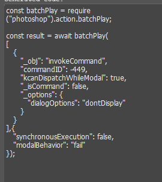
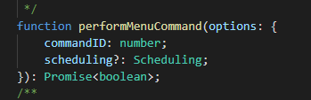
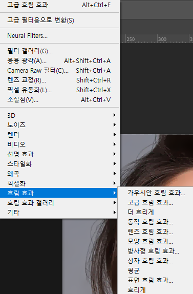
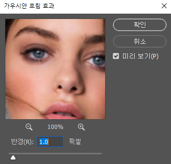

# 1월 4주차 주간보고서

- [x] UXP 기능 개발
- [x] UXP 설치파일

## UXP 기능 개발

uxp 코드 리팩토링 및 기능 추가를 진행했음.   
실습생 피드백 위주로 사진 편집에 자주 쓰는 기능들 추가함.

- invokeCommand 기능

기존에 invokeCommand 기능은 코드로 실행시켜도 `알 수 없는 명령어`라고 오류가 떴음. 

   

이 invokeCommand에서 나오는 `commandId`를 실행시킬 수 있는 API를 찾았음.

;

이 commandID변수에 id값을 넣으면 기능이 command 기능이 실행됨.   
이걸로 실습생 피드백에 나왔던 사진편집 자주 쓰는 필터 기능을 개발함

`commandid`만 알면 더 많은 기능을 개발할 수 있을듯.

## UXP 설치파일

uxp 설치를 크리에이티브 클라우드에서 깔 수 있음.   
인바이즈 스튜디오 설치 시 자동으로 설치되게 하려고 패키지 안에 있는 파일을 실행시키는 스크립트를 짜려고 시도했음.

파일 깔고 실행, 파일 깔고 열기,, 파일 깔고 1초뒤 실행, 패키지 안에있는 파일 실행, 패키지 안에있는 파일 열기, 등등 진짜 여러가지 방법 다 시도 해봤는데 안됨..   우선은 크리에이티브 클라우드에서 설치하라고 명시해야할 듯함.