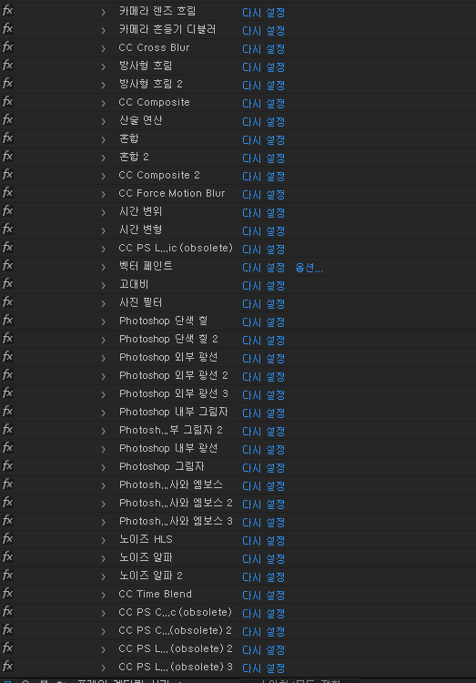
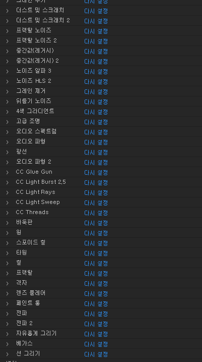
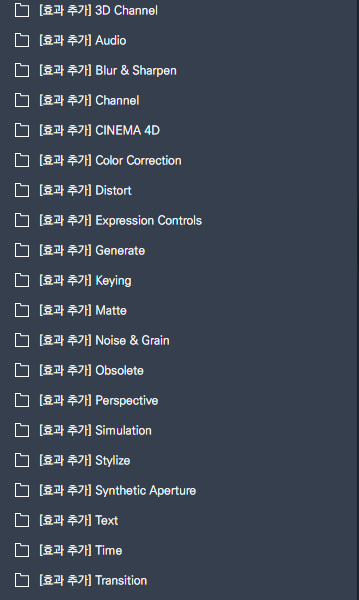
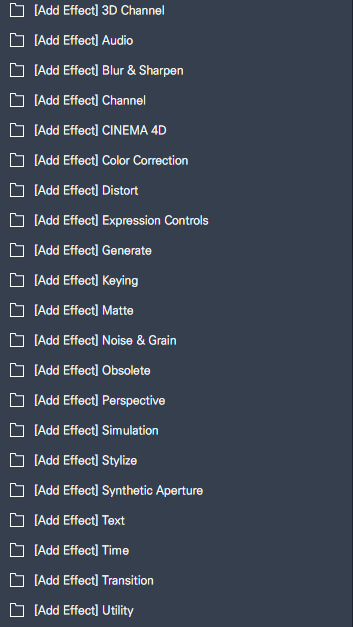

# 2월 2주차 주간보고서

- [x] 애프터이펙트 효과 테스팅 및 네이밍 통일화
- [x] 애프터이펙트 lumetri color 값 계산식 수정
- [x] 일러스트레이터 CEP 버그 수정
- [ ] 사진편집 추천프리셋 제작

이번주는 버그 수정 및 디테일 작업을 진행했습니다.

# 1. 애프터이펙트 효과 테스팅 및 네이밍 통일화

지난주 애프터이펙트 기본 제공 효과 데이터를 추가하는 작업을 진행했습니다.  
이 효과들이 정상적으로 동작하는지 확인하기위해 모든 효과들의 테스트를 진행했습니다.

## 1-1. 테스트 데이터 생성

```js
TestData = [
  {
    id: 107110,
    name: {
      ko: '[효과 추가] 3D Channel',
      en: '[Add Effect] 3D Channel',
    },
    functions: [
      {
        fname: {
          ko: '3D Channel Extract',
          en: '3D Channel Extract',
        },
        etype: 'sendCepScript',
        fcode: {
          messageType: 'command',
          actionType: 'AF_AddEffects',
          typeKey: 'ADBE AUX CHANNEL EXTRACT',
        },
      },
      {
        fname: {
          ko: 'Depth Matte',
          en: 'Depth Matte',
        },
        etype: 'sendCepScript',
        fcode: {
          messageType: 'command',
          actionType: 'AF_AddEffects',
          typeKey: 'ADBE DEPTH MATTE',
        },
      },
      {
        fname: {
          ko: 'Depth of Field',
          en: 'Depth of Field',
        },
        etype: 'sendCepScript',
        fcode: {
          messageType: 'command',
          actionType: 'AF_AddEffects',
          typeKey: 'ADBE DEPTH FIELD',
        },
      },
//...
```

## 1-2. 테스트 코드 작성

```js
try {
  $.writeln('start test');
  for (var i = 0; i < TestData.length; i++) {
    for (var j = 0; j < TestData[i].functions.length; j++) {
      var effectName = TestData[i].functions[j].fcode.typeKey;
      AeAddEffect.addEffectToSelectedLayers(effectName);
    }
  }
  $.writeln('succeeded test');
} catch (e) {
  $.writeln('failed test', e);
}
```

## 1-3. 테스트 성공




## 1-4. 네이밍 통일화




# 2. 애프터이펙트 lumetri color 값 계산식 수정

애프터이펙트에서 `노출` 값이 제대로 계산이 안되고 있었던 버그를 발견

그래서 해당 값에 대한 예외처리를 진행 했습니다.

```js
var property = lumetri.property(propsName);
if (null == property) {
  return;
}
var weight = propsName === 'ADBE Lumetri-0011' ? 0.1 : 1;
var newValue = 0;
if (0 == diff) {
  newValue = property.minValue + (property.maxValue - property.minValue) / 2;
} else {
  newValue = property.value + Math.abs(diff) * diff * weight;
}

if (newValue > property.maxValue) {
  newValue = property.maxValue;
} else if (newValue < property.minValue) {
  newValue = property.minValue;
}

if (property.numKeys == 0) {
  property.setValue(newValue);
} else {
  property.setValueAtTime(composition.time, newValue);
}
// 노출 값일 때만 소수점 return
var returnValue = weight === 1 ? property.value : property.value.toFixed(1);
return returnValue;
```

- 고려사항: 매번 소수점 값들 처리를 따로 해줬는데 min, max 값에 따라 `weight`값을 측정해서 같은 계산 알고리즘 이더라도 그에 대한 **가중치만 곱하도록** 변경할 방안 고려중입니다.

# 3. 일러스트레이터 버그 수정.

일러스트레이터 객체 모델 공식문서에 보면

### PathItem.resize()

> app.activeDocument.pathItems[index].resize(scaleX, scaleY[,changePositions][,changefillpatterns][,changeFillGradients][,changestrokepattern][,changeLineWidths][,scaleabout])

마지막 변수 `scaleabout`에 얼마만큼의 변형을 할지에 대한 수치를 넣어줘야 합니다.

일러스트에서 획조절 하면 소수점 값으로 조절이 안되는데 이를 스크립트로 정확하게 계산하기 힘들어서 소수점으로 계산하되 return 값을 소수점으로 보내주어서 사용자 혼돈을 방지하기로 했습니다.

버그 fixed

# 4.
