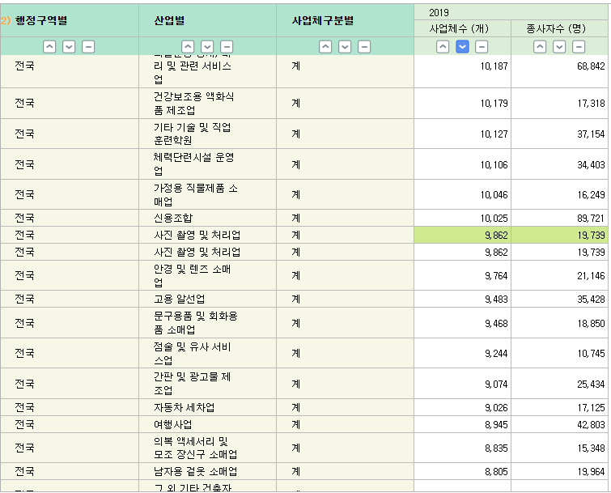
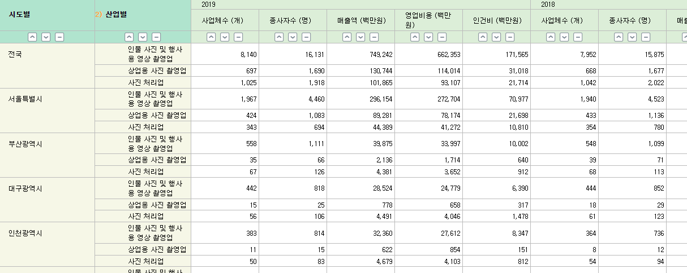
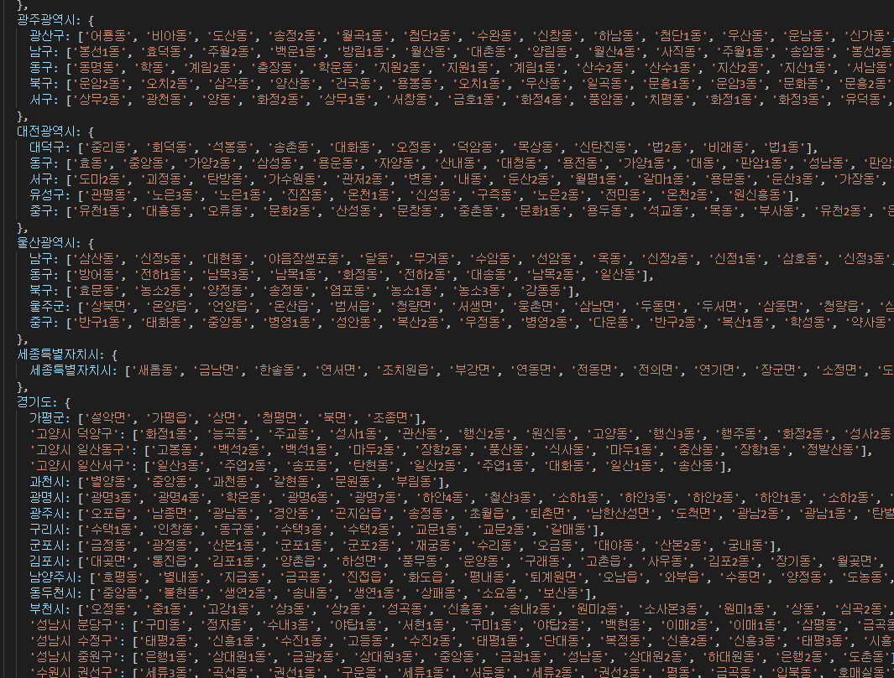
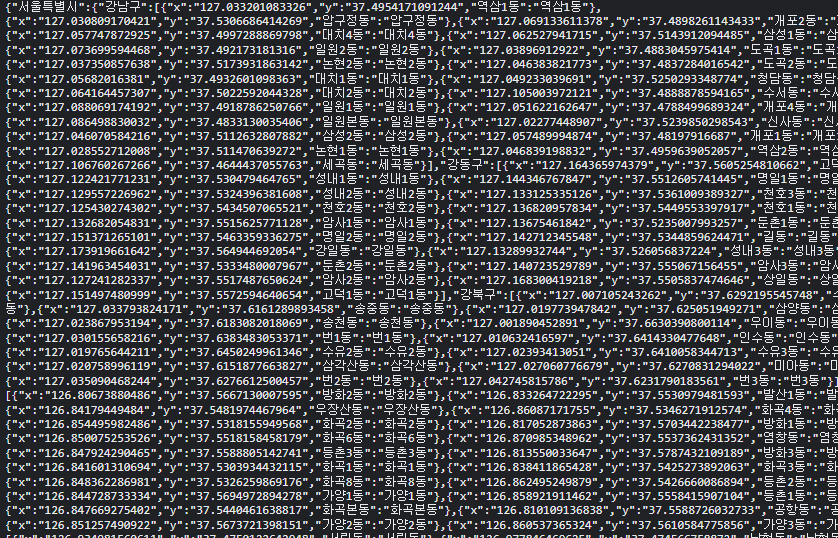
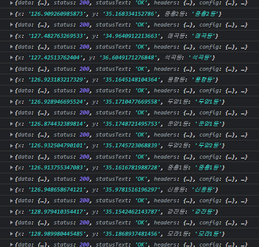
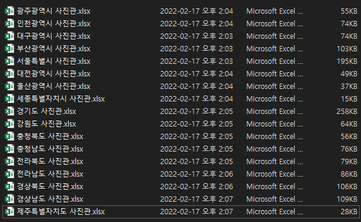
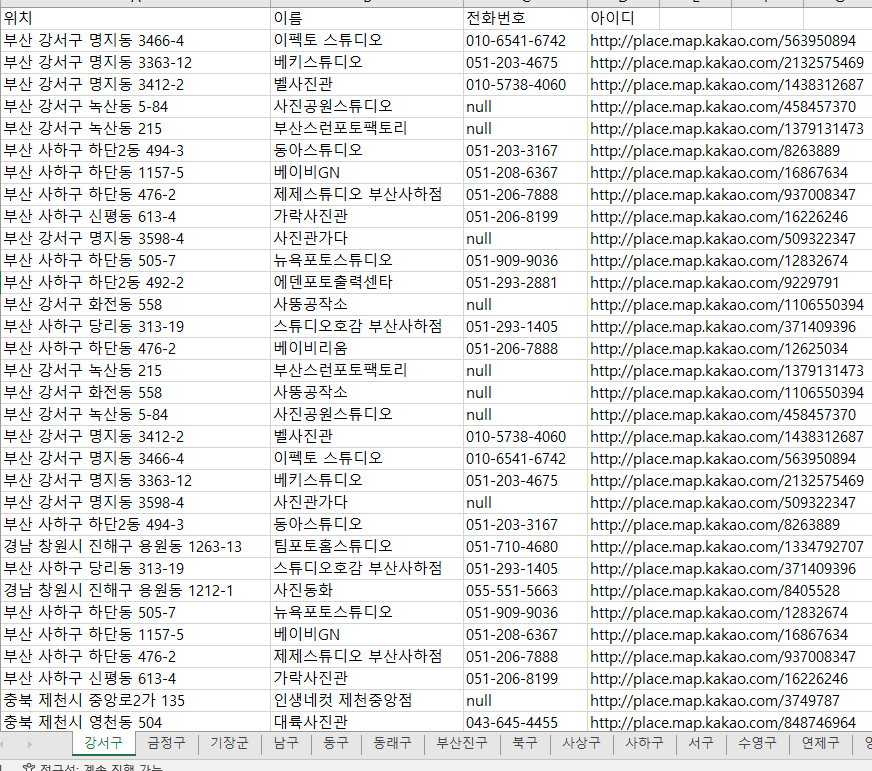

# 2월 3주차 주간보고서

- [x] 사진 및 영상 편집 시장조사 및 통계
- [x] 키워드 수집기 제작
- [x] 픽셀유동화 자동 보정 기능

## 1. 사진 및 영상 편집 시장조사 및 통계

1분기에는 사진에 집중하고 있는 만큼 확실한 시장조사가 필요하다고 생각해 어느 규모인지 조사를 진행했습니다.

### KOSIS 국가통계포털

> 국내통계 -> 주제별통계 -> 도소매 서비스 -> 10차 서비스업 조사 -> 시도/산업별 총괄 -> 전문, 과학 및 기술 서비스업 -> 기타 전문, 과학 및 기술 서비스업 -> 사진 촬영 및 처리업

### 통계

국내에서 집계된 `사진 촬영 및 처리업(2019)` 전체(9862개)중 `인물 사진 종사자` 가 `82.5%`로 계산된다.

## 2. 키워드 수집기 제작

위 조사를 기반으로 `인물 사진관`에 집중적으로 공략을 하는 전략을 짜보면 괜찮을 것 같다고 판단해서 국내에 인물 사진관 리스트를 받아오는 작업을 진행했습니다.

키워드 수집기 제작은 카카오 주소검색 API를 사용해서 진행했습니다.

우선 지역별 `시`,`구`, `읍,면,리` `동` 을 분류하는 작업을 진행했습니다.

이 분류된 지역을 기반으로 각 `동`의 중심좌표를 반환하는 작업을 진행했습니다.

이 중심좌표를 기반으로 각 `동`의 `사진관`을 긁어오는 작업을 진행했습니다.

이 데이터를 기반으로 각 `시`의 엑셀파일을 만들었습니다.

결과

### 추후 작업 예정

**파이썬 봇**을 제작해볼 예정입니다.

- API에서 카카오맵 상세보기 url이 주어지는데 이 url을 엑셀파일에 저장해 둡니다.
- 파이썬 봇이 엑셀에 저장되어 있는 url을 탐색해 url 내에있는 홈페이지에 접근합니다.
- 접근한 홈페이지에서 이메일 양식 (xxx@bbb.com)을 추출하고 다시 엑셀에 저장합니다.
- 저장된 이메일로 콜드콜 메일 자동화를 진행합니다.
