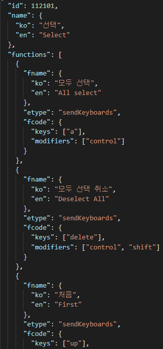
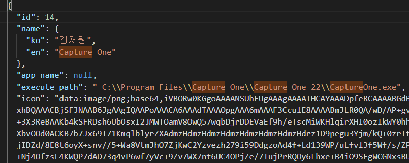
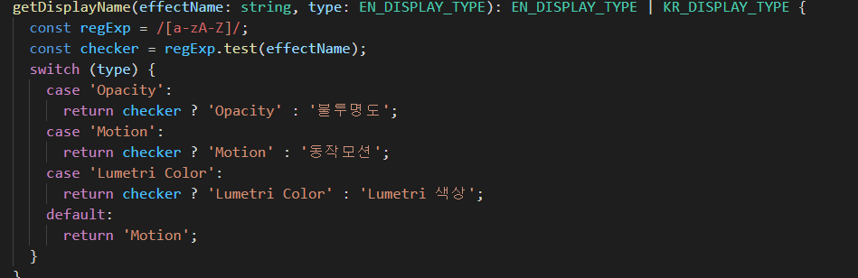

# 2월 4주차 주간보고서

- [x] 캡처원 데이터 번역
- [x] 캡처원 추가
- [x] 프리미어 프로 CEP 타입스크립트 전환 작업
- [x] 플러그인 자료 조사

## 캡처원 데이터 번역

캡처원 데이터 번역 작업 완료했습니다.

## 캡처원 추가

캡처원 프로그램을 `INVAIZ Studio 2.1`에서 사용할 수 있도록 추가 했습니다.

### 고려사항

- 캡처원을 무료버전으로 사용하다 보니 기한이 끝날 때 마다 재설치와 재 셋팅을 해야해서 엄청난 번거로움이 있습니다.
- 배포를 했을 시 버그 수정이나 기능 개발에 있어 무료버전은 매우 치명적인 대응이 될것 같습니다.
- 안정적인 배포를 하려면 정식 버전을 구매하는게 좋을 것 같다고 생각합니다.

## 프리미어 프로 CEP 타입스크립트 전환 작업

기존 `JavaScript`로 작성된 프리미어프로 CEP 코드를 `TypeScript`로 이전에 전환하는 작업을 진행했습니다. 이전에 타입 체크를 정확하게 하지 않아 `타입 가드`를 적용시켜 확실한 타입을 받는 작업을 진행했습니다.

### 고려사항

- 일본 수출 시 프리미어프로 일본어 버전 테스트를 진행해야 합니다.
- 기존에 프리미어프로에서만 발생하던 언어문제를 타입을 추가하여 해결하기에는 문제가 있어 다른 방법을 고려하고 있습니다.

## 플러그인 자료 조사

무료 플러그인 자료를 조사했습니다. Grid10과의 조합 혹은 플러그인 그 자체로 좋은 사용성을 낼 수 있는 플러그인들을 조사하려 했습니다.

[트랜지션효과](https://www.filmimpact.com/get-free-access/)  
[미스터홀스](https://misterhorse.com/premiere-composer)  
[자막효과](https://vidyssey.com/products/detail/qMJIEGtw?utm_source=youtube&utm_medium=youtube_branded&utm_campaign=0725_vc_branded)

### 고려사항

- CEP 커스텀 기능으로 Grid10과의 시너지를 기대해볼 수 있을 것 같습니다.
- 당장 해볼 수 있는 커스텀 기능들
  - 픽셀유동화 얼굴작게, 얼굴 크게, 갸름하게 등등 기본 사전설정
  - 색감 조정 사전설정
