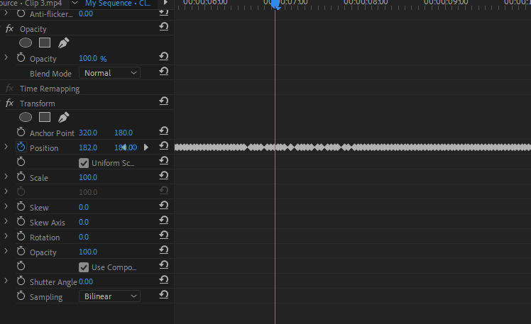

# 3월 1주차 주간보고서

- [x] 색감 보정 자료 조사
- [x] 색감 템플릿 키트 코드 작성
- [x] 이지프롭스 환경 설정
- [x] 이지프롭스 분석 및 테스트

# 색감 보정 자료 조사

색감 보정에 대한 가이드나 팁을 찾기 위해 자료 조사를 했습니다.  
여러 자료들이 있었지만 잘 정리되어있는 자료들만 몇 가지 골라 참고했습니다.

[색보정1](https://m.post.naver.com/viewer/postView.naver?volumeNo=16480170&memberNo=41739456)
[색보정2](https://www.dailypop.kr/news/articleView.html?idxno=47601)
[라이트룸 사전설정](https://photography.tutsplus.com/ko/articles/100-free-lightroom-presets-and-how-to-make-your-own--photo-8640)

## 고려사항

- 색감 키트를 작업할 때 라이트룸 사전설정 파일들을 참고하면 좋을 것 같습니다.

# 색감 템플릿 키트 코드 작성

색감 템플릿을 적용할 수 있는 테스트 코드 `프리미어프로` CEP를 통해 작성했습니다. 객체 구조는 `props` , `index` , `value`로 구성되어있습니다.

```js
var kit = [
  {
    props: 'Temperature',
    index: 13,
    value: 55,
  },
  {
    props: 'Exposure',
    index: 9,
    value: 0.5,
  },
  {
    props: 'Saturation',
    index: 15,
    value: -44,
  },
];
const project = app.project;
const seq = project.activeSequence;
const tracks = seq.videoTracks;
const clip = PrUtils.selecedClip(tracks);
const clipComponent = clip.components;
const isEng = PrUtils.isEng(clipComponent[0].displayName);
const effectName = 'Lumetri Color';

for (let i = 0; i < clipComponent.numItems; i++) {
  if (clipComponent[i].displayName === 'Lumetri Color') {
    const targetEffect = clipComponent[i];

    for (let j = 0; j < kit.length; j++) {
      const props = kit[j].props;
      const newValue = kit[j].value;
      const targetProperty = targetEffect.properties[props];
      if (!targetProperty.isTimeVarying()) {
        targetProperty.setValue(newValue, true);
      }
    }
  }
}
```

## 고려사항

- 초기화를 어떻게 진행해야 할지 고려해야합니다. 예를들어 템플릿 1이 적용된 상태에서 템플릿 2가 적용되면 모든 색감을 `0`으로 초기화 하는 작업을 진행해야 합니다.

# 이지프롭스 환경 설정

- 크롬에서 다운받을 시 악성 프로그램으로 인지해 다운로드가 되지 않아 이를 해결하고 다운로드 했습니다.
- 이지프롭스를 사용하기 위해 인증 코드를 발급받고 환경 설정을 마쳤습니다.

# 이지프롭스 분석 및 테스트

## 파일 찾기

Adobe 확장프로그램은 `C:\Program Files (x86)\Common Files\Adobe\CEP\extensions`에 설치가 되어야하는데 이지프롭스는 이 경로에 설치가 되지 않았습니다.  
어디 설치되는지 파악하기 위해 아이폰 슬로우 카메라로 설치 로그를 분석해서 보니 `C:\Users\username\AppData\Romings\Adobe\CEP\extension` 폴더에 설치되었습니다.

## 코드 분석

- 핵심코드인 `모션 알고리즘`은 바이너리파일로 암호화가 되어있어서 분석하지 못했지만 어떤 로직인지는 파악하였습니다.
- 단순히 키프레임을 찍는 알고리즘인데 이는 수식이 필요할 것 같습니다. (왼쪽에서 날라오기, 위쪽에서 나가기 등등 각각의 수식 필요)
  

- 인증된 PC 1대만 이용할 수 있지만 크랙 버전을 만들 수 있을 듯 합니다. 테스트가 필요하면 크랙버전을 만들어 보겠습니다.

## 고려사항

- 모션 알고리즘 수식을 개발하는데 시간이 꽤나 걸릴 듯 합니다.
- 디자인 팀에서 모션에 대한 논의를 같이 하면 좋을 것 같습니다.
