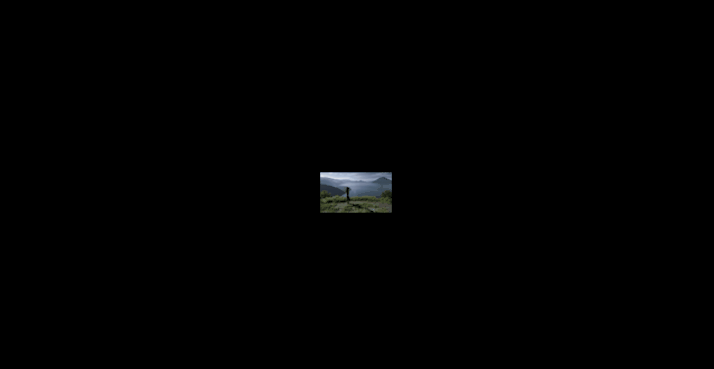

# 3월 2주차 주간보고서

- [x] 이지프롭스 테스트 버전 크랙 제작
- [x] 애니메이션 리서치
- [x] 테스트 모션 개발
- [x] 이지프롭스 분석

# 이지프롭스 테스트 버전 크랙 제작

모션 키트 플러그인 개발 시 이지프롭스의 테스트가 필요할 것 같아서 테스트 버전 크랙을 제작했습니다.

# 애니메이션 리서치

기본 애니메이션과 응용 애니메이션이 어떤 것이 있는지 찾아보고 정리했습니다.

### 기본 애니메이션

- 회전
- 점점 커지게, 작아지게
- 페이드 인
- 페이드 아웃
- 나가기, 들어오기
- 나타나기, 사라지기

### 응용 애니메이션

- 깜빡 깜빡
- 들어오면서 바운스
- 등등 ..

### 고려사항

- 응용 애니메이션 같은 경우는 기본 애니메이션들의 조합으로 몇 가지 만들 수 있을 것 같습니다.
- 프리미어프로 텍스트에 관련된(자막) 기능을 추가하면 좋을 것 같습니다.
- 텍스트 기능을 개발하면서 텍스트 관련 모션도 추가하면 좋을 것 같습니다.

# 테스트 모션 개발

- 기본 모션을 개발했습니다. 수식은 정확하지 않고 느낌만 살려 총 13개의 프레임에 애니메이션 키를 추가했습니다.

## 기본 모션

- 점점 커지게
  

- 페이드인
  

- 회전
  

## 응용 모션

- 왼쪽에서 바운스 하며 들어오기
  

- 회전하며 들어오기
  

# 이지프롭스 분석
