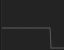
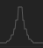
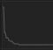
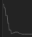
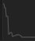
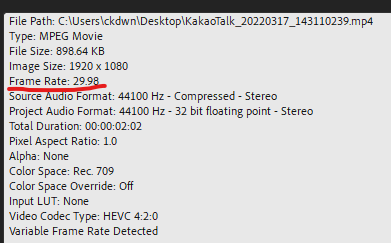
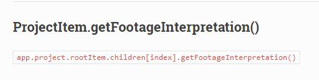
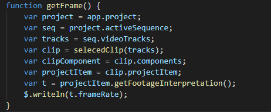
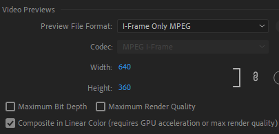
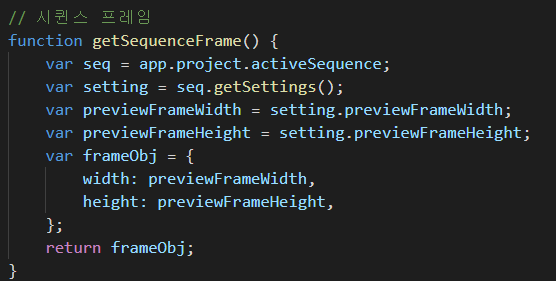

# 3월 3주차 주간보고서

- [x] 모션 알고리즘 분석
- [x] 모션 알고리즘 로직 개발

## 모션 알고리즘 분석

### 일정하게

- 일정하게 들어오는 (또는 나가는) 알고리즘은 `등차수열` 그래프이다.
- 등차수열의 비율은 `거리/프레임`으로 이동한다.
- 트랙의 `절대 시간`은 `트랙의 인포인트 시간이다.`

### 부드럽게

- 천천히 가다가 빨라졌다가 중간지점에서 끝지점까지 다시 천천히 간다.
- 부드럽게 들어오는 (또는 나가는) 알고리즘은 `등비수열` 그래프이다.

### 빠르게

- 시작 지점에서 다음 프레임까지 한번에 많은 양을 이동한 뒤 중간지점까지 서서히 이동하는 모션이다.
- 부드럽게 들어오는 (또는 나가는) 알고리즘은 `팩토리얼` 그래프이다.

### 스프링

- 특정 지점에서 `가중치`만큼의 값을 반대방향으로 더해서 진동을 일으키는 모션이다.
- 가중치를 `거리`와 `프레임`을 고려해서 구해야 한다.

### 바운싱

- 빠르게 모션과 스프링 모션의 합친 결과이다.
- 중간지점까지 빠르게 들어왔다가 뒷부분에 스프링 모션을 추가한다.

## 모션 알고리즘 로직 개발

지난 주에 개발한 템플릿 기반으로 사용자 커스텀이 가능한 로직을 개발하였다.

### 일정하게 모션

일정하게 모션은 `등차수열`이다. 사용자 커스텀이 가능하기 위해 개발하기전 고려해야할 사항들이 몇가지 있었다.

고려사항은 `시작 위치, 거리, 들어올 방향, 프로젝트 프레임, 시퀸스 프레임, 가중치` 를 고려해야 했다.

영상 별로 `프로젝트 프레임`과 `시퀸스 프레임`이 달라서 이를 구해주어야 했다.

### 프로젝트 프레임

프레임은 초당 몇개의 사진이 보여지느냐이다. 해당 프로젝트는 1초당 29개의 사진이 보여지는 영상이다.

이 시퀸스 프레임을 알 수 있어야 프레임 별로 모션을 입힐 수가 있으며 더욱 부드러운 모션이 나온다. 시퀸스 프레임의 정보를 가지고 있는 함수를 찾았다.

그리고 시퀸스 함수의 프레임을 가지고 코드를 작성했다.

### 시퀀스 프레임

다음은 시퀀스 프레임을 구해야 한다. 정확히 무슨 의미인지는 모르겠지만 영상 크기와 연관되어 있는것 같다. 영상마다 `width` ,`height`값이 전부 다르며 모션을 입힐 때 영상의 비율도 체킹을 해주어야 한다.

테스트 영상의 `width`,`height`값은 각각 640,360으로 되어있으며 이는 `position` 속성을 제어할 때 비율 계산을 위해 **꼭 필요한 값이다.**

해당 정보들로 `등차수열`을 기반으로한 일정하게 모션 점화식을 구현하면 다음과 같다.

> 가중치 = ((거리 \* 방향) / 프레임) -1
> 트랙의 현재 위치 = 속성 값 \* 시퀸스 너비 프레임
> 트랙의 다음 위치 = 현재 위치 + 거리 \* 방향 + 가중치
> 다음 인디게이터 시간 = 1 / 프로젝트 프레임

gif 첨부

### 부드럽게 모션

### 회전
