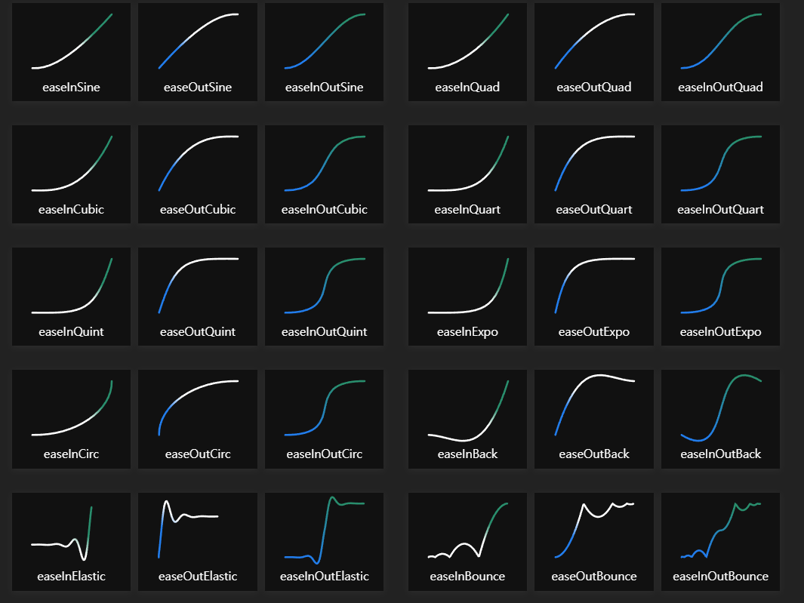
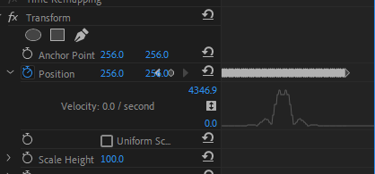

# 3월 4주차 주간보고서

- [x] 모션 키트 CEP 프로젝트 초기 셋팅
- [x] 모션 키트 구조 설계
- [x] 배지에 곡선 알고리즘 기반 easing 함수 개발

# 모션키트 CEP 프로젝트 초기 셋팅

- 패널 이름은 INVAIZ Motion Kit로 임의로 설정했습니다.
- 구조를 설정하고 와이어프레임 디자인을 했습니다.
- 

# 모션 키트 구조 설계

- Motion 효과보다 Transform 효과에 있는 속성들로 제어를 하는것이 좋다고 판단했습니다.
- 선택한 트랙아이템을 찾고 그 안에서 사용자가 선택한 모션이 실행되게 하는 구조로 설계했습니다.

# 배지에 곡선 알고리즘 기만 easing 함수 개발

베지어 곡선(Bezier Curve)은 컴퓨터 그래픽스에서 사용되는 특별한 형태의 곡선으로, CSS 애니메이션 등에서 도형을 그릴 때 사용합니다.

곡선 자체는 매우 단순하기 때문에 한 번 공을 들여 공부해 두면 벡터 그래픽스나 고급 애니메이션을 다룰 때 도움이 됩니다.

- 배지에 곡선으로 구현할 수 있는 easing function

;

- 지난주는 노가다로 식을 만들었는데 그렇게 되면 정확하지 않고 프레임별로 예외가 발생합니다.

- 위 그림에 나오는 모든 애니메이션은 배지에 곡선 알고리즘으로 개발 가능할 것으로 보입니다.

## easeInBouce 알고리즘 테스트

- 배지에 곡선으로 easeInBouce를 구현해보았습니다.
- 말도안되게 부드러워 지고 그래프도 정확하게 찍혔습니다.

;

