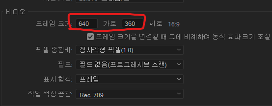
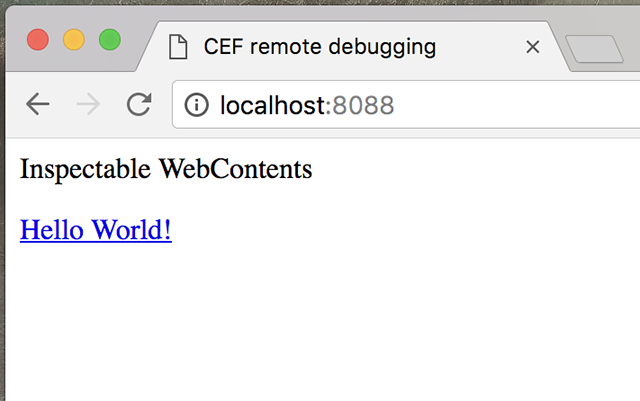

# 4월 1주차 주간보고서

- [x] 프리미어프로 버그 수정
- [x] 디버깅 환경 설정
- [x] 인터페이스 재 설계

# 프리미어프로 버그 수정

- 기존 프리미어프로 프레임 크기(`sequence.width` , `sequence.height`) 값이
  640: 320으로 고정되어있었던 버그를 해결했습니다.

- 프레임 크기와 관련된 값 (앵커포인트, 스케일 등)을 프레임별로 테스팅을 진행해야합니다.

# 프리미어프로 디버그 모드 설정

- 호스트 ID가 단일인 CEP 프로젝트를 구축 후 디버깅할 수 있는 환경을 설정했습니다.

- 매번 Extend Script Toolkit을 사용하여 코드테스트 할 필요없이 테스트 패널을 구축할 예정입니다.

- 디버깅은 크롬 개발자도구로 할 수 있게 셋팅 중입니다.

- UI 개발 시에도 웹으로 확인할 수 있어서 유용합니다.

# 인터페이스 재설계

## 기존구조의 문제점

- 기존 구조의 문제점은 버전업데이트 시 속성이 바뀜.
- 언어체크를 별도로 하여여야함
- 서브 속성을 가진다면 하나씩 체크 해줘야함

## 새로운 구조

- 이펙트 별로 인터페이스를 구축중

- 좋은 구조일지 테스트 해봐야함
