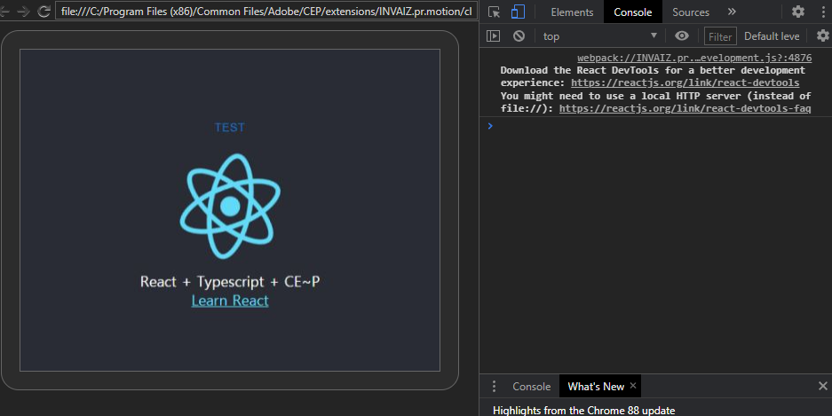
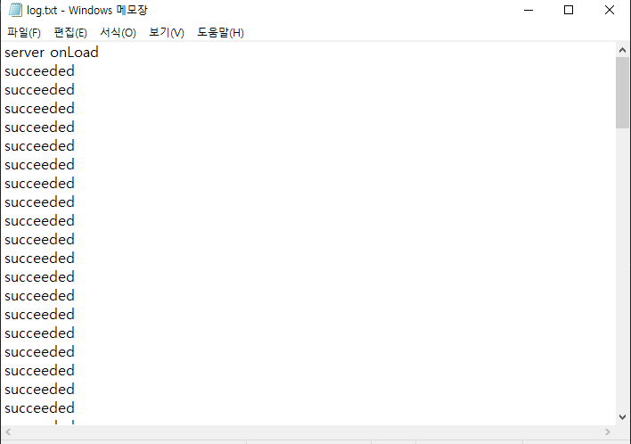

# 4월 2주차 주간보고서

- [x] CEPeact 개발환경 설정
- [x] CEP Debuging tool 설정
- [x] 프리미어프로 v22.3 루메트리 속성 버그 수정중
- [x] CEP error log 작업

# CEP + React 개발환경 설정

- view 작업을 하기 위해(플러그인) 기존 HTML+CSS+Javascript로 구현하기 제한적이어서 아예 React 환경을 셋팅해보았습니다.
- 기존 CEP에서 React를 사용하기 위해 webpack과 babel을 이용해 개발환경을 설정했습니다.

### 고려사항

- 아직 아무도 CEP + React + Typescript 개발환경을 구축한 곳이 없는데 오픈소스로 기여할 수 있을 것 같은데 어떻게 생각하는지?

# CEP Debuging tool 설정

- 이제 view 작업을 해야 하기 때문에 크롬에서 디버깅 할 수 있게 셋팅했습니다.

# 프리미어프로 v22.3 루메트리 속성 버그 수정중

- v22.3이 되면서 루메트리 컬러 속성이 또 변경되었습니다.
- 버전별로 속성이 달라서 모든버전에 맞게 처음부터 설계를 다시 진행하고 있습니다.

# CEP error log 작업

- CEP에서 에러가 발생하면 CEP 서버에서 에러 로그를 남기는 작업 진행중입니다.
- 로그 포멧과 에러 메시지는 아직 정하지 않음

  
