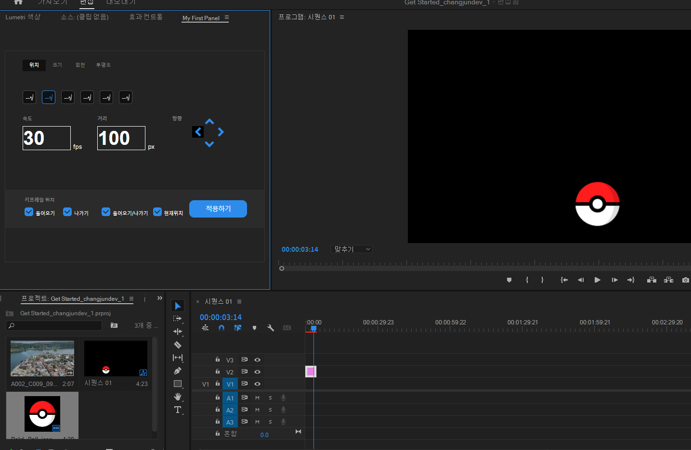
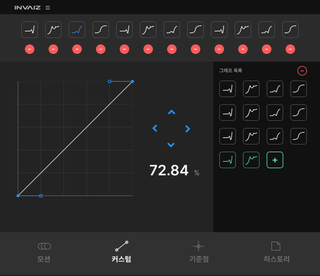

# 5월 2주차 주간보고서

- [x] 프리미어프로 모션키트 베타 버전 개발

## 프리미어프로 모션키트 베타 버전 개발

### 뷰 작업 완료

- 뷰 작업을 완료 하였음.

- 기본 제공하는 Easing 그래프를 6개 제공함(그래프 모양 적용 x)
- `dragable`한 input box도 생성했는데 적용하면 좋을 듯

### easing 함수 연동 완료

- 객체에 함수를 담아 CEP로 넘겼지만 string으로 변환 후 넘겨야 하기 때문에 **함수가 깨지는 이슈 발생**
- 따라서 easing 함수를 CEP 측에서 처리하기로 하고 객체에는 어떤 `easing 함수`를 실행시킬 지 데이터만 넘김

## 추후 진행 사항

- 배지어 곡선 그래프를 커스텀 할 수 있는 라이브러리를 찾음
- 이 기능은 유료 버전에 배포되면 좋을 듯 함
