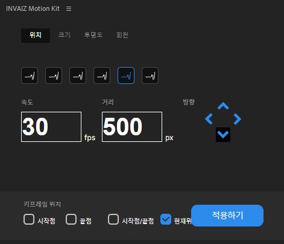
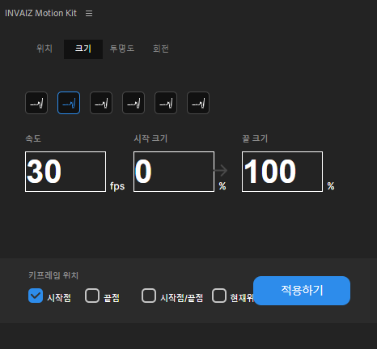
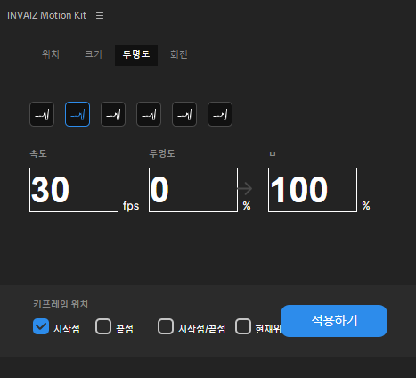
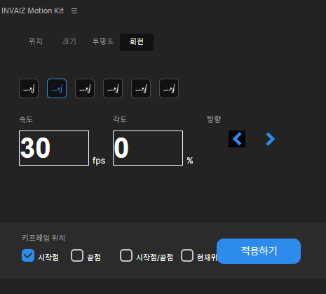

# 5월 3주차 주간보고서

- [x] 모든 패널 뷰 작업 및 CEP 연동
- [x] 텍스트 객체 이슈 해결

## 모든 패널 뷰 작업 및 CEP 연동

;
;
;
;

## 텍스트 객체 이슈 해결

- `TrackItem` 객체에는 자식객체로 `ProjectItem` 객체가 존재함 (비디오나 사진)
- 하지만 텍스트 객체에는 `ProjectItem`객체가 존재 하지 않아 계산 시 `NaN`으로 계산되는 버그가 발생


- 해당 이슈를 임의의 프레임 `23`프레임으로 설정하여 해결

```js
function getProjectFrame() {
  var project = app.project;
  var seq = project.activeSequence;
  var tracks = seq.videoTracks;
  var clip = utils.getSelectedClip(tracks);
  var projectItem = clip.projectItem;
  if (projectItem) {
    var t = projectItem.getFootageInterpretation();
    return t.frameRate;
  } else {
    return 23.0; //임의의 프레임 생성
  }
}
```

## 모션 키트로 간단한 모션 제작한 결과

- 이 모션을 제작하는데 걸린시간 `3초`


## 진행사항

- 초기화 기능 추가하여야함
- 종료시 마지막 상태 저장하여 플러그인 로드시 설정값 자동 셋팅(진행중)
- UI/UX 디테일 잡아야함 (로딩창, 상태바, 드래그블 인풋, 모달창 ..등등)
