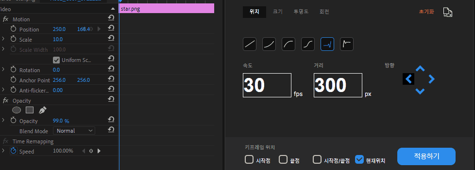
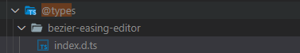
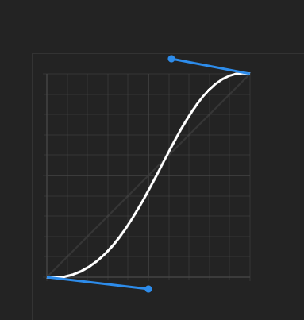

# 5월 4주차 주간보고서

- [x] 모션 키트 베타버전 완성
- [x] 모션 키트 cubic-bezier-editor 개발

## 모션 키트 베타버전 완성

### 1. 다중 선택 가능

- 기존에는 다중 선택을 해도 첫 번째 객체만 적용되었는데 이를 다중 선택시에도 적용 가능하게 코드를 수정

;
;

### 2. 초기화 기능

- 적용된 모션을 초기화 하는 기능을 개발
- 초기화 전 알림창을 띄울지 말지 고려중

  

### 3. 덮어쓰기 기능

- 적용된 모션 위에 새로운 모션을 적용하게 만듦
- 임의의 명칭으로 `덮어쓰기` 라고 했는데 명칭을 수정해야 할 듯

;

## 모션 키트 cubic-bezier-editor 개발

### 모듈 이슈 해결

- cubic-bezier-editor는 타입스크립트를 지원하지 않아 직접 모듈 내보내기 파일을 작성함



```js
declare module 'bezier-easing-editor';
```

### 곡선 편집기 개발


