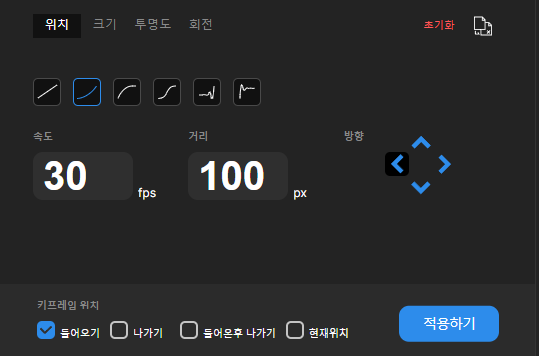
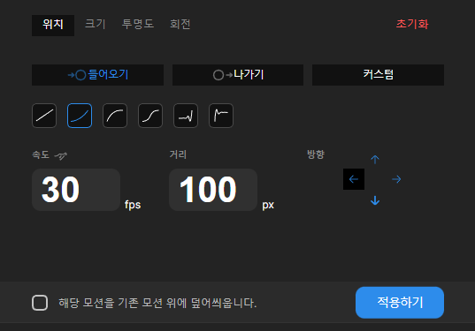
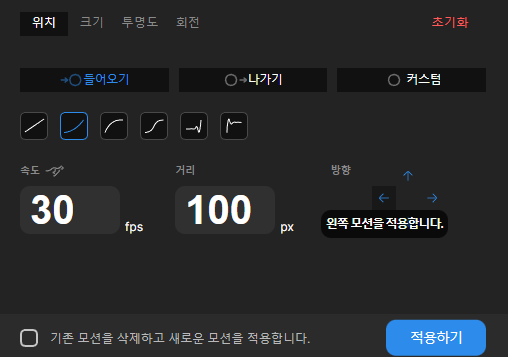

# 5월 5주차 주간보고서

- [x] 디자인 변경사항 구조 수정

## 기존 디자인의 문제점

- 위치 모션에 대해 방향 감각이 각자 다름
- 들어오기, 나가기, 들어온후 나가기, 현재위치에 대한 용어의 모호함
- 덮어쓰기에 대해 제대로 인지하지 못하는 점

  

## 해결 방안

- 방향 감각에 대해 확실히 인지하고자 화살표 아이콘을 바꾸기로 결정
- 각 모션마다 들어오기, 나가기, 들어온후 나가기 용어를 고정하지 않음
- 예를들어 크기는, 점점 커지게(ZoomIn), 점점 작아지게(ZoomOut), 투명도는 페이드인, 페이드 아웃 식으로 표현하여 인식시킴
- 덮어쓰기는 확실하게 용어로 설명하여 사용자에게 인식시킴

## 디자인 및 백그라운드 스크립트 수정

- 들어오기, 나가기등 키프레임 위치에 대한 탭을 없애고 모션이름으로 변경
- 방향 아이콘 수정 및 백그라운드 스크립트 수정

- `덮어쓰다` 라는 표현이 헷갈릴 수 도 있어서 아예 텍스트를 `" 기존 모션을 삭제하고 새로운 모션을 적용합니다."` 라고 수정함

