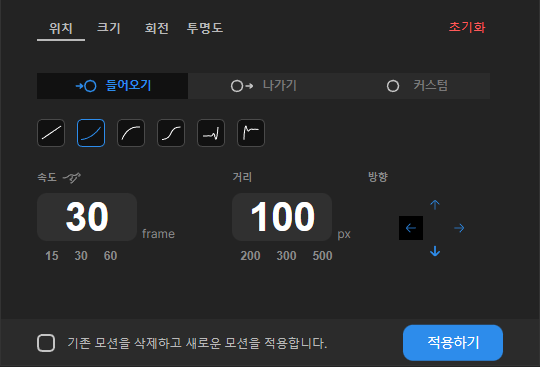
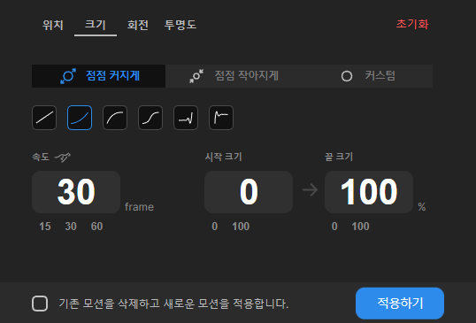

# 6월 2주차 주간보고서

- [x] 디자인 변경사항 작업
- [x] 디자인 디테일 수정

# 디자인 변경사항 작업

- 디자인 변경 사항 작업을 마무리 했습니다.

  
  
  

# 디자인 디테일 수정

- 헤드라인 텍스트에 해당 값과 바인딩 시켜 드래그 시 값이 변경되도록 설계하였습니다.

- 값이 비어있을 때 해당값으로 모션을 적용하면 `0`이 적용되어 실제로 에러가 없지만 다음번 로드 시 값이 제대로 셋팅이 안되어 렌더링이 안되는 버그 발생

- 이 이슈를 `input` 값이 비어있을 시 `defaultValue`값을 설정해 초기화 시켰습니다.

- 모션을 초기화 했을 시 스낵바를 띄웠습니다.

