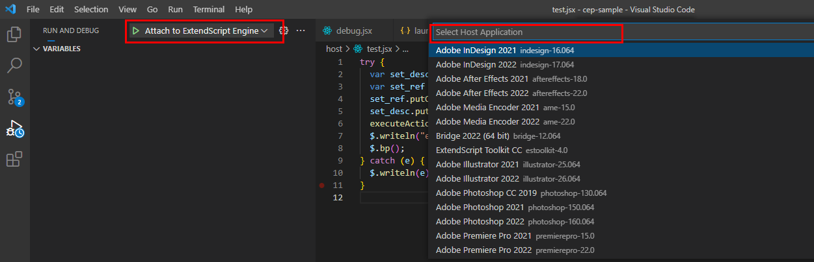

# 6월 17일 재택근무 보고서

## ExtendScript Debugger 마이그레이션 진행

### launch.json 구성요소 마이그레이션

V1 버전에서 V2 버전으로 마이그레이션을 마저 진행했습니다.

ExtendScript 디버거 V2에서 많은 부분이 변경되었습니다. 안전성, 성능, 유연성이 크게 향상되고 기본 VS Code 기능과 호환성이 개선되었습니다.

V1속성에서 ` enginName`,`debugLevel ` 등 다른 옵션들이 제거되고 남아있는 속성은 V2에서 아래와 같이 재구성 되었습니다.

| V1              | V2               |
| --------------- | ---------------- |
| targetSpecifier | hostAppSpecifier |
| program         | script           |
| excludes        | hiddenTypes      |

### 디버거 lanugh.json 파일 시작 구성 초기화

- 변경 전

```json
{
  "version": "0.2.0",
  "configurations": [
    {
      "type": "extendscript-debug",
      "request": "launch",
      "name": "Run Current Script",
      "script": "${file}",
      "hiddenTypes": [
        "undefined",
        "builtin",
        // "Function",
        "prototype"
      ]
    }
  ]
}
```

- 변경 후 구성

```json
{
  "version": "0.2.0",
  "configurations": [
    {
      "type": "extendscript-debug",
      "request": "attach",
      "name": "Attach to ExtendScript Engine"
    }
  ]
}
```

- 불필요한 옵션들이 제거되고 `Attach to ExtendScript Engine` 옵션 하나만으로 디버그 세션을 시작할 수 있습니다.

### 디버깅

- 기존에 호스트 어플리케이션을 선택하는 방식에서 엔진 자체로 호스트 어플리케이션을 찾는 방식으로 바뀐듯.
- 호스트 응용 프로그램 내에서 실행중인 ExtendScript 엔진에 연결하고 디버깅을 시작하는 방식.



- 매번 스크립트를 실행할 때마다 엔진을 연결해야 하는 불편함이 있는데 이건 설정하는 방법을 아직 못찾은것 같음 계속 서치중

## 배포 방식에 대한 리서치
