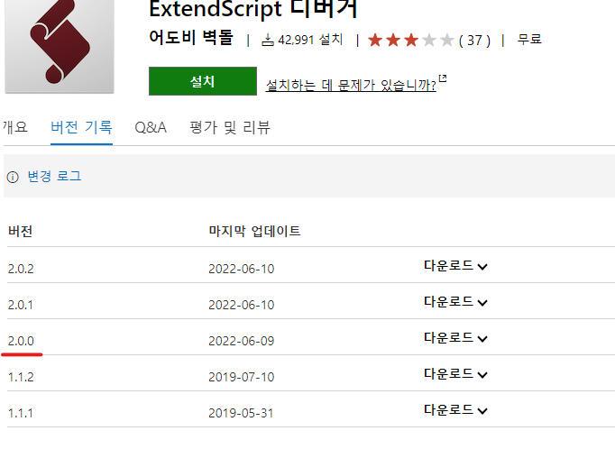

# 6월 3주차 주간보고서

- [x] Adobe ExtendScript Debugger Migration
- [x] Plugin Build Process Design
- [x] 배포 방식 조사
- [] VSCode C++ 개발환경 설정

## Adobe ExtendScript Debugger Migration

- 어도비 스크립트를 디버깅 할 수 있는 VSCode 확장이 약 3년만에 새로운 릴리즈가 나왔습니다.
- 이에 구성요소를 대부분 수정하고 설정하는 방식이 바뀌었기 때문에 마이그레이션을 진행하였습니다.
- 큰 변경 내용은 속성 테이블 네이밍 변경, 확장 사용방식 변경, 호스트 프로그램 연결 방법 , 디버깅 방식 변경 입니다.
- launch.json 파일이 더욱 간결해지고 구성이 간단해졌습니다.
- 기존 디버깅 방식에서 많은것이 개편되었습니다.
- 자세한 내용은 일일 보고서에 있습니다.

## Plugin Build Process Design

- 플러그인 빌드 프로세스를 구축했습니다.
- 소스코드 보안을 위해 바이너리 파일로 배포할 예정입니다.
- npm의 jsx 모듈을 이용해 `jsx to jsxbin` 변환 작업을 진행했습니다.
- jsxbin 파일은 jsx파일의 암호화된 파일로 소스코드가 암호화되어 나오고 난독화가 불가능합니다. 따라서 코드 복사에 대한 우려를 덜어낼 수 있습니다.
- 정적 파일은 번들링되어 나오기 때문에 클라이언트 단에서 악의적인 크랙파일 생성을 방지할 수 있을거로 보입니다.
- 100%의 보안은 없을거로 보입니다. 혹시나 번들링된 코드를 해석하여 동작하는 크랙파일을 생성할 수 있습니다. 
- V2 디버거에 jsx to jsxbin 기능을 제공하여 V2 Debugger로 빌드하는 방법을 모색중에 있습니다.

## 배포방식 조사

- 플러그인을 어떻게 배포할지 조사 및 탐구했습니다.
- 첫 번째로 어떻게 설치할 것인지를 조사했고 두번째는 어떻게 인증할 것인지 조사했습니다.

### 1. 설치파일 형식

- 윈도우에서 배포파일을 만들때 `NSIS` 스크립트를 사용합니다. 맥은 `pkg`파일을 생성해서 설치파일을 만들 수 있습니다.
- 이 방식으로 만들면 홈페이지를 통한 배포로 이루어집니다.
- 두 번째 방법은 `Adobe Exchange`를 이용한 `.zxp`파일 배포방식입니다.
- `.zxp` 파일은 CEP 코드사인을 통해 서명이 완료되면 생성됩니다.

## VSCode C++ 개발환경 설정

- 현재 윈도우에서 dll 방식으로 로드되는 네이티브 모듈이 일렉트론 버전과 호환이 안되는 이슈가 발생했습니다.
- electron-edge-js 모듈을 사용하였는데 이 모듈이 일렉트론 17.0.0 이후 버전과 호환이 안되는 이슈가 있습니다.
- 이로 인해 카메라로우 및 픽셀유동화의 기능이 최신버전에서 동작이 안되고 있습니다.
- 해결방법은 node-gyp를 이용해 최대한 외부모듈에 의존하지 않고 자체 개발을 하는 방식으로 개발해야합니다.
- 이를 위해 C++ 개발환경 설정이 필요했고 vscode 로 개발환경을 설정중에 있습니다
