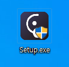

# 6월 4주차 주간보고서

- [x] 테스트기간 E-Motion 인증 개발
- [x] E-Motion NSIS 인스톨러 파일 생성
- [x] Native Modules

## 테스트기간 E-Motion 인증 개발

- 테스트기간 플러그인 인증을 어떻게 하면 좋을까 고민하다가 특정 기한까지 사용가능하게끔 제작했습니다.
- 다른 방식으로 토큰을 발행해 사용자별로 발급기간으로부터 n일까지 사용하게 만드려고 했지만 n월n일로 테스트 기간을 정해놓고 하는게 좋을 것 같았습니다.
- 사용자 컴퓨터마다 시간이 달라 기간 인증에 이슈가 생길수도 있어 마이크로소프트 서버 홈페이지 시간을 체크하였습니다.
- 이후에는 토큰인증 방식으로 사용자별 유효 기한을 설정해야합니다.
- 테스트 기간이 만료되면 만료페이지를 띄웠습니다.
- 번들링된 빌드파일에서 유효기간을 조작하면 크랙파일이 만들어질 우려가 있습니다.

## E-Motion NSIS 인스톨러 파일 생성

- NSIS로 스크립트를 작성하였습니다.
- 플러그인 설치파일 아이콘을 요청하였고 설치파일을 만들었습니다.
- 기존에는 nsis에서 제공하는 `7z` 플러그인을 이용해 파일 설치시 압축을 해체하는 방식으로 설치를 진행했지만 현재는 압축을 해체하지않고 폴더 파일 전체를 설치하는 방식으로 바꾸었습니다.

### 고려사항

- 배포시 필요한 다운로드 페이지가 필요합니다.
- mac 인스톨러 파일도 만들어야합니다.
- 상세 페이지 디자인도 필요합니다.
- 사용자 데이터 수집에 대한 방안을 모색해봐야 합니다.

## Native Modules

- 최근 카메라로우 및 픽셀유동화 등 네이티브 모듈로 개발한 API에 오류가 발생했습니다.
- 원인을 찾아보니 electron v17.0.0 이후부터 `electron-edge-js`(자바스크립트에서 윈도우 프로그래밍한 소스와 호환되게 해주는 브릿지 역할)이 호환되지 않는 이슈가 발생했습니다.
- 따라서 외부 모듈에 의존하지 않고 현재 mac에서 개발한 방법인 `node-gyp`를 사용해 자체 모듈을 개발하려고 합니다.
- 우선은 `electron-edge-js`가 electron v17.0.0 이후 버전에서 실행되는 [fork된 프로젝트](https://github.com/JesseRedfield/electron-edge-js)가 있어 이 모듈을 사용해 해결했습니다.

## 이슈

- 일부 프리미어프로에서 패널이 열리지 않는 이슈가 있는데 원인을 찾지못했습니다.
- 플러그인 문제는 아닌듯한데 프리미어프로 문제일 가능성이 높습니다.
- 마땅한 해결방안도 없어서 테스트 해봐야하는데 제 컴퓨터에서는 너무 잘됩니다..
