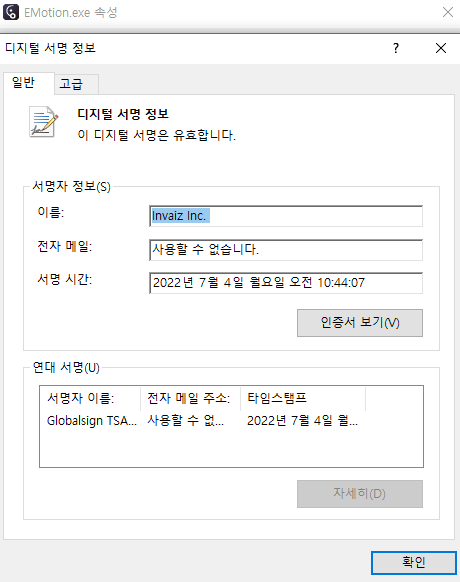

# 6월 5주차 주간보고서

- [x] E-Motion 회전 모션 수정
- [x] 플러그인 이벤트 링크 생성
- [x] 플러그인 인스톨러 코드사인 진행
- [x] 구독 결제 플랫폼 조사

## E-Motion 회전 모션 수정

- 회전 모션을 개발하는 도중 커뮤니케이션 미스가 발생해 해당 요구사항대로 다시 수정하였습니다.
- 처음에는 회전 바퀴와 각도값으로 3바퀴 15도면 15도를 3번 돌려 총 45회 회전으로 개발되었습니다.
- 이를 1바퀴에 360도 회전시키게 수정하였습니다. ex) 1바퀴 15도 = 375도

## 플러그인 이벤트 링크 생성

- 플러그인 이벤트 링크를 생성하였습니다.
- anchor 태그로 링크를 연결하니 CEP패널 내부에서 웹사이트가 뜨는 현상이 발생했습니다.
- 이를 해결하기위해 csInterface API문서를 찾아보니 외부 웹사이트 링크를 열어주는 API(openURLInDefaultBrowser)를 제공하고 있었고 이를 사용해 해결했습니다.

## 플러그인 인스톨러 코드사인 진행

- 플러그인 인스톨러 코드사인 진행했습니다.
- 코드사인을 진행하기 전에는 안전하지 않는 파일, 알수없는 게시자 등 악성 프로그램으로 인식해 윈도우 보안에 걸리는 문제가 발생했습니다.
- 이에 플러그인 인스톨러에도 GlobalEV 코드사인을 진행하였습니다.

## 구독 결제 플랫폼 조사

- 구독 결제 플랫폼을 조사했습니다.

[스텝페이](https://www.steppay.kr/)  
[페이먼트 월](https://www.paymentwall.com/kr/products/subscriptions)  
[페이플](https://www.payple.kr/pay/card/regular)  
[KG이니시스](https://www.inicis.com/sv-regular)
