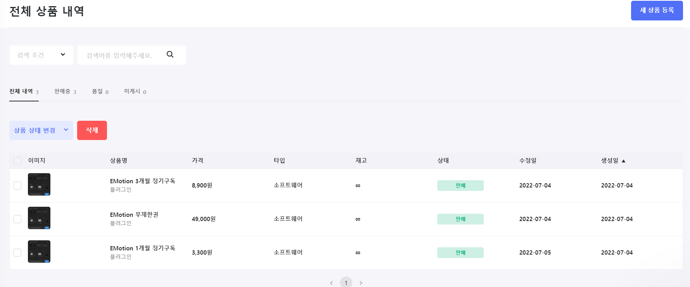

# 7월 1주차 주간보고서

- [x] 스텝페이 이용사례 조사
- [x] 구독 결제 플랫폼 스텝페이 셋팅

## 스텝페이 이용사례 조사

- 스텝페이 이용사례에 대해 조사했습니다.
- [스텝페이 이용사례 살펴보기](https://steppay.notion.site/b47bee538ba1470baaf7ad7d5014071a)
- 소프트웨어 구독 플랫폼사례는 많지 않고 대부분이 오프라인 구독 플랫폼인듯 합니다. (커피구독, 노트북 구독, 면도기 구독,, 등등)
- AI 음악 구독 서비스 [포자랩스](https://pozalabs.com/)는 소프트웨어 서비스인것 같습니다 하지만 구독방식이 어떻게 되는건지 확인해봐야 할 것 같습니다.

## 구독 결제 플랫폼 스텝페이 셋팅

[스텝페이 결제모듈 연동 가이드](https://steppay.notion.site/PG-6bb1b3886b28473ea4e699027a8e4592#eaa714fb1ab242f2bcb266068ce32ade)

### 스토어 생성

- 스토어 생성시 필요한 정보를 기입하고 스토어를 생성하였습니다.

### 상품 생성

- 임의의 상품을 생성하였습니다.
- 상품 생성시 최소 3개의 제품을 생성해야해서 임의로 1개월권, 3개월권, 무제한이용권을 생성하였습니다.
- 현재 상품에 셋팅된 모든 내역은 임의의 데이터입니다.  
  

### 이용 약관 및 개인정보 처리방침 작성

- 플러그인에 사용에 필요한 이용약관 및 개인정보 처리방침을 작성하였습니다.
- 스텝페이에서 제공하는 양식 그대로 사용하였고 추가할 건 추가하고 삭제할건 삭제했습니다.

  [이용약관](https://0909404eb74b.mystore.steppay.kr/terms-conditions)  
  [개인정보처리방침](https://0909404eb74b.mystore.steppay.kr/privacy-conditions)
