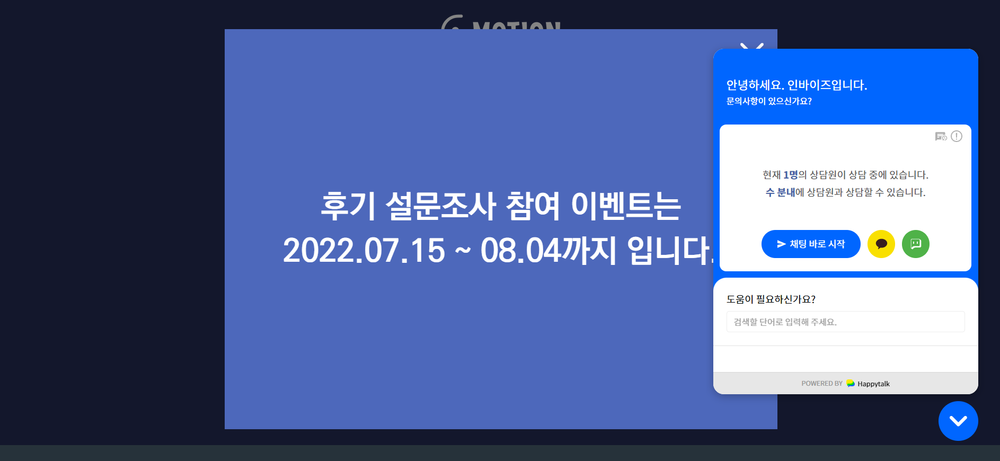
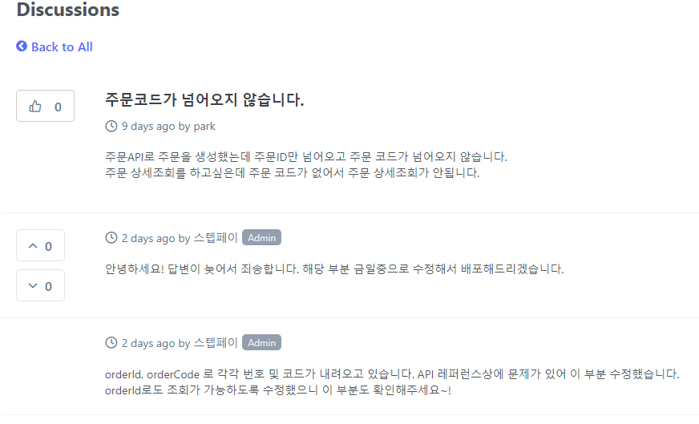

# 7월 2주차 주간보고서

- [x] 플러그인 랜딩페이지 해피톡 연동
- [x] 디자인 시스템 픽셀 스토리 초안 작성
- [x] 스텝페이 테스트를 위한 포스트맨 셋팅

=======

- [x] 스텝페이 문의 작성 및 수정 내용 테스트
- [x] API 테스트를 위한 포스트맨 초기 셋팅

## 플러그인 랜딩페이지 해피톡 연동

- 플러그인 랜딩페이지에 기본 윅스쳇을 삭제하고 해피톡을 연동했습니다.

  
  

## 디자인 시스템 픽셀 스토리 초안 작성

- 디자인 시스템 픽셀 스토리 초안을 작성하고 문서화를 진행했습니다.
- 해당 문서는 스토리북이 배포되면 확인할 수 있습니다.
  

## 스텝페이 문의 작성 및 수정 내용 테스트

- 스텝페이가 아직 완전한 서비스가 아니기 때문에 API 테스트를 진행하면서 생긴 버그들을 문의로 남겼습니다.
  
- 해당 내용을 문의 페이지에 전달하였고 스텝페이 개발자가 수정 완료되었다고 해서 (수정 중인 것도 있습니다.) 테스트를 진행했습니다.
- 예를들어 주문 상세 조회를 위해 주문코드가 필요했는데 주문 코드가 넘어오지 않아 해당 API를 사용할 수 없던 버그가 있었습니다.
- 이러한 버그들을 문의로 남겼고 해결 완료된 API를 테스트 진행했습니다.
  
  
